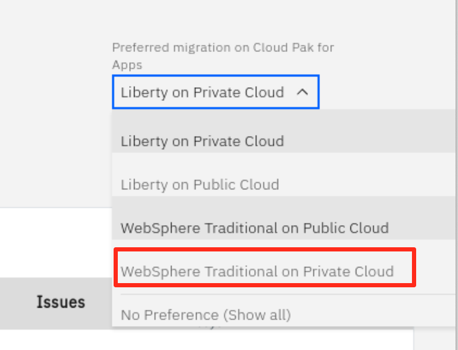
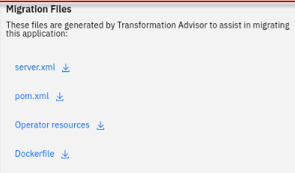
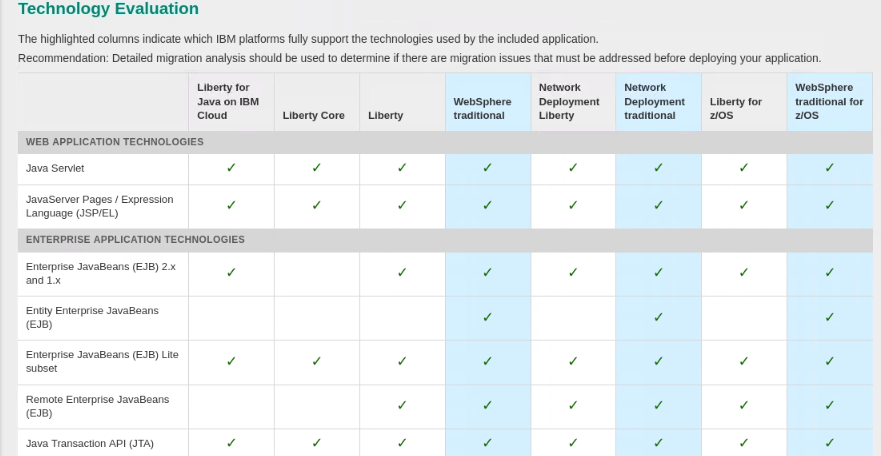

# **ITC-19**

# **Evaluate Java Application with IBM Cloud Transformation Advisor**

**Modernizing WebSphere / Java applications for Cloud and Containers**

 

## Lab:  Evaluate On-Premises Java Applications with IBM Cloud Transformation Advisor 

On the journey to cloud, enterprise customers are facing challenges
moving their existing on-premises applications to cloud quickly and
cost-effectively. The I**BM** **Cloud Pak for Applications** provides a complete and consistent experience and solution to modernize enterprise applications for cloud-native deployments. Customers can easily modernize their existing applications with IBM’s integrated tools and develop new cloud-native applications faster for deployment on any cloud. One of the tools included in the Pak is the IBM Cloud
Transformation Advisor (**Transformation Advisor**), a developer tool
that is available at no charge to help you quickly evaluate on-premises Java EE applications for deployment to the cloud.

**The Transformation Advisor tool can**

  - identify the Java EE programming models in the app.
  - determine the complexity of apps by listing a high-level inventory
    of the content and structure of each app.
  - highlight Java EE programming model and WebSphere API differences
    between the WebSphere profile types
  - learn any Java EE specification implementation differences that
    might affect the app

Additionally, the tool provides a recommendation for the right-fit IBM
WebSphere Application Server edition and offers advice, best practices
and potential solutions to assess the ease of moving apps to Liberty or newer versions of WebSphere traditional. It will accelerate application migrating to cloud process, minimize errors and risks and reduce time to market.

This lab is a part of the Application Modernization lab series which
focus on the evaluation, re-platform, repackage, and refactor
modernization approaches and solutions.

This lab covers the evaluation process. It will show the value of using **Transformation Advisor** to evaluate on-premises Java applications and identify a migration candidate for moving to the cloud. When you complete this lab, you will learn how to use this tool to quickly analyze on-premise Java applications without accessing their source code and to estimate the move to cloud efforts.

 

## Business Scenario

As shown in the image below, your company has several web applications
deployed to WebSphere Application Server (**WAS**) environment.

Your company wants to move these applications to a lightweight WebSphere Liberty server on cloud, but you are not sure how much effort the migration process might take.

You decide to use the **Transformation Advisor** to do a quick
evaluation of these apps without their source code (Binary Scan using
TA) to identify a good candidate application to move to cloud based on
the analysis results.

 

## Objective

The objectives of this lab are to:

  - learn how to collect Java application and configuration data using
    the **Transformation Advisor** Data Collector tool.
  - learn how to use the Transformation Advisor to evaluate the move to cloud efforts and to identify the good candidate for migration.

## Prerequisites

The following prerequisites must be completed prior to beginning this
lab:

  - Familiarity with basic Linux commands
  - Have internet access
  - Have basic Java app development knowledge.

The following symbols appear in this document at places where additional guidance is available.

| Icon                                              | Purpose              | Explanation                                                                                                                                                |
| ------------------------------------------------- | -------------------- | ---------------------------------------------------------------------------------------------------------------------------------------------------------- |
|          | Important\!          | **This symbol calls attention to a particular step or command. For example, it might alert you to type a command carefully because it is case sensitive.** |
|             | Information          | **This symbol indicates information that might not be necessary to complete a step, but is helpful or good to know.**                                      |
|  | **Trouble-shooting** | **This symbol indicates that you can fix a specific problem by completing the associated troubleshooting information.**                                    |

## What is Already Completed

Four (4) Linux VMs have been provided for this lab.

  - The OpenShift Container Platform, **OCP v4.2**, included with
    **Cloud Pak for Applications**, is installed in four VMs, the
    **master1** VM, the **dns** VM, the **worker1** VM, with one master node and one compute node.

  - A local version of **IBM Cloud** **Transformation Advisor**, running on Docker container is used for this lab.

    > The **Transformation Advisor** can be deployed to the **RHOCP**
    > cluster as a part of **IBM Cloud Pak for Applications** installation.
    > It also can be installed as a stand-alone local application.
    > 
    > For more information on how to install a local version of the
    > **Transformation Advisor**, please visit:
    > <https://www.ibm.com/cloud/architecture/tutorials/install-ibm-transformation-advisor-local>

  - The CLI commands used in this lab are listed in the **Commands.txt** file located at the **/home/ibmdemo/cp4a-labs/lab1** directory of the **Workstation** VM. You can use this to **copy / paste** these commands to the Terminal window during this lab.

 

The **Workstation** VM is the one you will use to access and work with the **OCP cluster** in this lab.

The **login credentials** for the **Workstation** VM are:

    User ID: ibmdemo
 
    Password: passw0rd

  

## Lab Tasks

In this lab, you access WebSphere Application Server to review the
deployment of the JEE applications. Then you are going to the
Transformation Advisor to identify a good candidate application for
moving to cloud.

To identify which Java EE programming models are on the server, you
could run the Transformation Advisor Data Collector tool against the
server. The Transformation Advisor creates an inventory of the content
and structure of each app and learn about problems that might occur if
you move the app to cloud.

Finally, you review the analysis reports to determine the complexity of the move-to-cloud efforts and select the migration candidate app.

**Here are the activities involved in this process:**

  - Log in to WebSphere Application Server to review the deployed JEE
    applications
  - Run the Transformation Advisor Data Collector tool against the
    WebSphere Application Server to get application data
  - Review the analysis reports that Transformation Advisor generates to identify the right candidate application for a rapid and
    cost-effective migration to cloud

 

## Execute Lab Tasks

### To get started, login to the environment 

1.  Log in to the Workstation VM and Get Started
    
    a) If he VMs are **not** already
        started, start them by clicking the **Play** button
      > 

    b) After the VMs are started, click the **Workstation** VM icon to
    access it.

      > 
 
The **Workstation** Linux Desktop is displayed. You will execute all the lab tasks on this VM.

  

## **Review the on-prem WebSphere apps**

In this task, you will take a look at the sample applications deployed
to the local WebSphere Application Server (WAS) environment. You are
going to identify one of them to be the god candidate to move the cloud.

1.  Start WebSphere Application Server, which is running on the
    Workstation VM. The DB2 database it accesses runs in a Docker
    container on the VM.

     In the **Workstation** VM, we have a local WebSphere Application
 Server which hosts several sample applications.
 
     **To start the WAS server:**

    a)  Open a terminal window by clicking its icon on the **Workstation**
    VM desktop tool bar.

    > 

    b)  In the terminal window, issue the command below to start the WAS server (You can ***copy / paste*** the command from the
    **Commands.txt** file located at **/home/ibmdemo/cp4a-labs/lab1**

        /home/ibmdemo/cp4a-labs/shared/startWAS.sh
 
      when prompted, enter the **sudo** user password as: **passw0rd**.
 
    > 
 
     Within a couple of minutes, the WAS server will be ready.

2.  Access the WAS Admin Console to view the application deployed by
    clicking the web browser icon desktop tool bar to open a browser
    window.

     > 

    a)  From the **Web browser**, click **WebSphere Integrated Solution Console** bookmark to launch the WAS console.

    > 

    b) Login to the WAS Admin Console login page, using the credentials below:
    
        User: wsadmin
        Password: passw0rd 

    c) On the WAS Console page, click **Applications** -\> **Application   Types** -\> **WebSphere enterprise applications** to view the apps
    deployed.

    > 
 
    In the **Enterprise Applications** list, you can see all applications deployed. 
    
    Next we will use Transformation Advisor to analyze these
applications to identify a good candidate to be moved to the cloud.

  

## **Launch Transformation Advisor** 

The Transformation Advisor can evaluate any Java based applications. In this lab, you are going to use it to evaluate whether the on-premises WebSphere application, **Mod Resorts**, is suitable to move to cloud and what the effort might be to get it there.

The Transformation Advisor is installed locally on the **Workstation**
VM. Launch the Transformation Advisor tool using the steps below.

1.  From **Workstation** VM Desktop Tool Bar, click the Terminal icon to open a Terminal window.

    > 

2.  Launch the **Transformation Advisor** with command:

        /home/ibmdemo/ta-local/transformationAdvisor/launchTransformationAdvisor.sh

3.  Type **5** and press **Enter** to start the **Transformation
    Advisor**.

    > 

4.  The **Transformation Advisor** application is started, right-click
    the application URL link and select **Open Link** to launch it in a web browser window.

     > 
 
     The **Transformation Advisor** Home page is displayed.
 
     > 

  

## **Download Transformation Advisor Data Collector utility**

Now the Transformation Advisor is running, you will use its Data
Collector utility to get the application data from WebSphere Application Server running on the **Workstation** VM.

To evaluate on-premises Java applications, you need to run
**Transformation Advisor** Data Collector utility against the
Application server environment. It will extract all application
information from the environment. The utility can be downloaded from the Transformation Advisor web page.

1.  From the Transformation Advisor Home page, Add a **new workspace**
    by entering the workspace name as **Evaluation** and then clicking
    **Next**.

    > 

<table>
<tbody>
<tr class="odd">
<td></td>
<td>
 A workspace is a designated area that will house the migration recommendations provided by <strong>Transformation Advisor</strong> from your application server environment. You can name and organize these however you want, whether it’s by business application, location, or teams
</td>
</tr>
</tbody>
</table>

2.  Enter the collection name as **Server1** and click **Let’s go**.

    > 

<table>
<tbody>
<tr class="odd">
<td></td>
<td>
 Each workspace can be divided into collections for more focused assessment and planning. Like workspaces, collections can be named and organized in whatever way you want.
</td>
</tr>
</tbody>
</table>

3.  Once the **Workspace** and **Collection** are created, you will have options to either download the Data Collector utility or upload existing data file. In this lab, we ae going to use the Data Collector
 utility to get the data from the local WebSphere environment.
    
    a)  Click **Data Collector** to go to the download page.

    > 

4.  In the Download page, you can download different versions of the
    utility based on your source operating system. It also shows how to use the command line utility to collect application data from
    WebSphere, WebLogic and Tomcat servers.
    
    a) Since the lab VM is a Linux OS, click **Download Linux** to get the utility.

    > 

    b) In the Download dialog window, select the **Save File** option and click **OK**.

    > 

    The zipped Data Collector utility file will be saved in /**home/ibmdemo/Downloads** directory of **Workstation** VM.

  

## **Run Transformation Advisor Data Collector utility**

After downloading the zipped Data Collector utility, we need to unpack
it and run the utility against the WAS server to collect all the data of deployed applications and their configuration from the WAS server.

1.  Go back to the terminal window and navigate the **/home/ibmdemo/Downloads** directory and view its contents with commands:

        cd /home/ibmdemo/Downloads/
 
        ls -l
 
    You can see the downloaded data collector utility file saved in the directory.
 
    > 

2.  Extract the data collector utility with commands:

        tar xvfz transformationadvisor-Linux\_Evaluation\_Server1.tgz

    The data collector utility will be extracted to
***/home/ibmdemo/Downloads*/transformationadvisor-2.0.2** directory.

3.  Execute the **Data Collector** utility with the commands below to
    start collect the deployed applications information on the WAS
    server.

        cd /home/ibmdemo/Downloads*/transformationadvisor-2.0.2

        sudo ./bin/transformationadvisor -w /opt/IBM/WebSphere/AppServer -p AppSrv01 wsadmin passw0rd

            when prompted, enter the sudo password as: passw0rd

4.  Type **1** to accept the license agreement and press **Enter**, as
    illustrated below

    > 
 
    **Note:** The utility will start to collect application data.
 
    > 
 
    This process will take a few minutes to complete, depending on how many applications are deployed on the WAS server. In this lab, it might be a few minutes.
 
     When the collection utility competes, you will see a message “**Thank  you for uploading your data. You can proceed to the application UI for doing further analysis.”**
 
    Your application data is collected, it is saved as a zip file in
 directory **/home/ibmdemo/Downloads/transformationadvisor-2.0.2/AppSrv01.zip**, as shown below.

    > 
 
    In general, if your application server and the **Transformation  Advisor** are in the same network infrastructure, the collected data will be automatically uploaded to **Transformation Advisor** for you to view the analysis results.
 
     Otherwise, you must manually upload the data to **Transformation Advisor** before you can view the results.

 

## **Evaluate On-Premises Java Applications**

In this section, we are going to use **Transformation Advisor** UI to
view the application data analysis results.

1.  Go back to **Transformation Advisor** page in web browser, click the **Recommendations** link to the **Recommendations** page.

    > 
 
    In the **Recommendations** page, you can see all applications deployed to the WAS server are listed.

    > 

    On the **Recommendations** page, the identified **migration source
 environment** is shown in the **Profile** section, and the **target
 environment** is shown in the **Preferred migration** section. 
 
    > 
 
    The data collector tool detects that the source environment is your WebSphere Application Server ND **AppSrv01** profile. The target environment is **Liberty on Private Cloud**, which is the default target environment.
 
    The Recommendations page also shows the **summary analysis results** for all the apps in the **AppSrv01** environment to be moved to a Liberty on Private Cloud environment.
 
    **For each app, you can see these results:**
    - Complexity level
    - Technology match
    - Dependencies
    - Issues
    - Estimated development cost in days
     
      

    > 

    For example, if you want to move the
 **modresorts-1\_0\_war.ear** application to Liberty on Private Cloud,
 the complexity level is **Simple**.
 
    The Tech match is **100%**, which indicates that the application code **does not need to be changed** before it can be moved to cloud. The application has no dependency, has **1 minor level issue** and the estimated development effort is 0 day.
 
    As you can see, the default move to cloud environment is **Liberty on Private Cloud**. However **Transformation Advisor** can also provide migration options if you want to migrate your application to different target environments. In this lab we are focusing on identifying a good candidate for moving to the Liberty on Private Cloud environment, so the default target environment will work for us. 
 
    > 

    If you look at the complexities of these applications, you can see
 that the **moderesorts-1.0\_war.ear** (**Mod Resorts** app) and
 **pbw-ear.ear** (**PlansByWebSphere** app) has the simple complexity,
 which mean that these two apps can be migrated to cloud without any
 code change.
 
     But since the **moderesorts-1.0\_war.ear** app has fewer potential issues (1) than the **pbw-ear.ear** app (4).
 
     Let’s look at the analysis results for **moderesorts-1.0\_war.ear** application in detail.

2.  Click the **modresorts-1\_0\_war.ear** link to expand its analysis
    results to view the assessment and reports.

    > 

    The first section in the detail analysis summary page is the **Overall
Complexity** section. The overall complexity for the application is
**simple**, indicating that the application can be directly moved to
cloud without any code change.

    > 

     

    a) Scroll down to **Application Details** section.

    You can see there is **no code change** required.
     
    The the estimate migration overhead development cost is 5 days.
     
    This estimate is based on data from IBM Services engagements,which includes migrating management, server configuration, and testing.
 
     

3.  Continue to scroll down to the **Issues** section. You can see the only minor potential issue listed is on configuring the application in Docker container.

    > 

4.  Next, scroll down to the bottom of the page and click the
    **Technology Report** link, this will open a new browser window to
    show the application **Evaluation Report**.

    > 
 
    The report lists all java technologies the application uses and
whether these technologies are supported by a specific WebSphere
platform from Liberty for Java on IBM Cloud to WebSphere traditional
for z/OS.
 
    It is used to determine whether a particular WebSphere product is
suitable for an application.
 
    > 
 
    As we can see from the report, the **Mod Resorts** application only uses Java Servlet which is supported by all WebSphere platforms.

5.  Go back to the **Transformation Advisor** page and click the
    **Analysis Report** link.

    > 

    a) Click **OK** to continue

    
 
    > Now you see the **Detailed Migration Analysis Report** opened in a new browser window.
 
    
 
    > This is the **deep-dive report** which shows all issue found at the code level.

    b) Scroll down to **Detailed Results by Rule** section, you can see all the java technology issues identified based on different
     migration rules.

    > For the **Mod Resorts** application, there is one warning rule
regarding the application configuration in Docker containers.
 
     

    c) Click the **Show results** link related to the Warning for     configuration in Docker containers.

    > You can see the **detail analysis of the issue at code level**, in a specific class file and specific line. This will help developers to pinpoint where the issue is, or potential issue may be.
 
    

    d) Click the **Show rule help** link.

    
 
    > This will expand the **Rule Help** section which provides recommended solutions on how to fix the issue.
    > 
    > For the Docker container configuration issue, the utility provides best practice suggestion to externalize the configuration for the container
 
    

6.  Go back to the **Transformation Advisor** page and click the
    **Inventory Report** link.

    > 
 
    The **Inventory Report** helps you examine what is in your
 application, including the number of modules, their relationships and
the technologies in those modules.
 
    It also gives you a view of all the utility JAR files in the
application that tend to accumulate over time. Potential deployment
problems and performance considerations are also included.

    > 

    a) Scroll down to view this report which serves as good
    decision-making tool to inform you what is inside your app
    runtime. It helps provide a clearer understanding of the app
    runtime, the components it has and the relationships among them.

    
 
    > From the analysis reports we looked at above, we know that the **Mod Resorts** application is supported by Liberty on Private Cloud as the target environment, and the issue that the tool identified would not affect the application migration.
    > 
    > You can confidently select the application as a good candidate for moving to liberty on cloud in the repackage process with minimum effort.

7.  Now you know that the **Mod Resorts** application can be repacked to Liberty on cloud, you want to know if it is also a good candidate to re-platform with WAS Base on cloud.
    
    a) To do that, return to the TA **recommendations** page. Then
        change the target environment from **Liberty on Private
        Cloud** to **WebSphere Traditional on Private Cloud**.

    
 
    > As you can see from the TA recommendation, the **Mod Resorts** application is also a good candidate for re-platform in WAS container on cloud, if desired.
    >
    > If you want to review the recommendation details, you can follow the same steps you did before to go over them.
 
    

 

## Quick Detour - Additional powerful capabilities in Transformation Advisor! 

### How Transformation Advisor helps Modernize a Java EE application to IBM Cloud Pak for Applications on RedHat OpenShift**

Transformation Advisor helps accelerate the development activities
required during the modernization of a Java EE application currently
deployed to IBM WebSphere Application Server, Oracle WebLogic, Apache
Tomcat or Red Hat JBoss Application Server.

The capabilities of Transformation Advisor help bring the cloud-native
development experience to the modernization of existing WebSphere / Java applications.

For reference, the cloud-native development process using Application
Stacks simplifies the process of building and deploying applications to Kubernetes

View the **migration bundle** contents for the ModResorts application

Transformation Advisor generates migration artifacts that are needed to deploy a modernized application to IBM Cloud Pak for Applications and RedHat OpenShift. This section simply provides a quick peak into this exciting capability from Transformation Advisor. Additional hands-on labs on these capabilities can be arranged through your IBM
representative.

1.  Click on the menu with the “hamburger icon” next to the ModResorts
    application analysis to display the menu choices and choose **View
    migration plan**:  
      
    >   
      
    Transformation Advisor will display details about the migration
    bundle that it generated to accelerate the modernization of this
    application into IBM Cloud Pak for Applications. The migration
    bundle includes diverse artifacts, depending on the needs of the
    application.  
      
    As illustrated below, the user can choose to create a migration
    bundle for either:
    - a **binary** project of an application (uploading a WAR/EAR file and its dependent libraries)
    - a **source** project of an application, so that the application
    source files can be modernized and maintained.
    
      

    

2.  Notice the contents of the migration bundle. (**Migration Files**)  
      
    > 

The artifacts change, depending on the user’s modernization choices for the application (Source or Binary).
 
The default selection for an application that uses only EE7 features
and above will be to deploy as a **source application project**.

The project will be a source project, with the directory structure set
up with a starter application and the Liberty configuration for the
application.  
   
To accelerate the application modernization, the artifacts produced by
Transformation Advisor include the configuration for the Liberty
server, the build file for the application which can used with the
Application Stacks, Dockerfile and Operator files for containerized
deployments to RedHat OpenShift with IBM Cloud Pak for Applications.  
   
The user will be able to choose to **download** the artifacts as a
migration bundle or **push the bundle contents into a GitHub**
repository. See the illustration below.
 
> 

A complete exploration of these exciting capabilities is beyond the scope of this lab. However, these powerful features avaiable in Transformation Advisor help expedite the journey to cloud for existing WebSphere Applications. 

  

## **Evaluate the PlantsByWebSphere Application**

You have evaluated and assessed modernizing a simple application that uses only a single Java EE technology.  Now, let’s explore a more sophisticated Java EE application that was developed using many Java EE API's found in traditional WebSphere Applications. 
 
1.  Navigate back to the **Transformation Advisor** **Recommendations**
    page. You can follow the same procedure you did for the **Mod
    Resorts** application to view the analysis results for the
    **PlantsByWebSphere** application.

    > 
 
    As you can see from the Summary list, the recommendations for the  application to move to cloud are as follows: 
  - The complexity level is Simple.
  - Tech match is 100%, which means that the application code can be
    deployed to Liberty on Private Cloud without any changes. 
  - The app has 3 dependencies and 7 issues, including 1 high severity
    level, 1 medium severity level and 5 low severity level. 
  - The estimated development effort is 0 day because no code changes
    are needed.

2.  View the **Application Technology report** for
    **PlantsByWebSphereEE6.ear** application.

    Notice all of the technologies that this application uses, all of which are suported in ALL of the editions of WebSPhere.

    > 
    
    > 

### **Evaluate the Complex DefaultAppliction Application**

1.  Navigate back to the **Transformation Advisor** **Recommendations** page. Select the **DefaultApplication.ear** application.

    > 
 
    As you can see from the Summary list, this is a more complex application to modernize.

2.  View the **Application Technology report** for
    **DefaultApplication.ear** application.

    As you review the Technology report, you will discover that the application makes extensive use of EJB Entity Beans. EJB Entity beans are a deprecated Java EE technology, and not supported in WebSphere Liberty, which is the preferred WebSphere edition for Cloud environments.  
 
    The modernization of this application is more complex due to the need to rewrite parts of the application with Java EE technologies that are supported on WebSphere Liberty.
 
    However, **WAS Base** in **containers** is an alternative for running the application in IBM Cloud Pak for Applications with RedHat OpenShift. This option would allow you to move the application to cloud in containers (IBM Cloud Pak for Applications with Redhat OpenShift) with little or NO code changes.
 
    As the technology report reveals, the EJB Entity Beans technologies are supported in the traditional WAS Base and WAS ND editions. WAS Base in containers is a supported configuration in IB Cloud Pak for Applications.
 
    So, for this application, you might choose to move the application to WAS Base in containers, on cloud.
 
    > 

    > 

  

## Summary

In this lab, you learned how to evaluate the existing Java application
using **IBM Transformation Advisor**.

As a part of IBM App Modernization solutions in **IBM Cloud Pak for
Applications**, the **Transformation Advisor** tool provides a
recommendation for the right-fit IBM WebSphere Application Server
edition and offers advice, best practices and potential solutions to
assess the ease of moving apps to Liberty or to **WAS** container, or to newer versions of WebSphere traditional.

It will accelerate application migrating to cloud process, minimize
errors and risks and reduce time to market. To learn more about IBM App Modernization solutions, please visit [Cloud Pak for
Applications](https://www.ibm.com/cloud/cloud-pak-for-applications).

 

**Congratulations\! You have successfully completed the lab “Evaluate
On-Premises Java Apps with Transformation Advisor”.**
