# ITC-20:

# App Modernization using WAS Base Container in IBM Cloud Pak for Applications & RedHat OpenShift

  

## Lab: App Modernization Using WAS Base Container on OCP

On the journey to cloud, enterprise customers are facing challenges moving their existing on-premises applications to cloud quickly and cost-effectively.

The **IBM Cloud Pak for Applications** provides a complete and
consistent experience and solution to modernize enterprise applications for cloud-native deployments. Customers can easily modernize their existing applications with IBM’s integrated tools and develop new cloud-native applications faster for deployment on any cloud.

One of the tools included in the Cloud Pak for Applications is the **IBM Cloud Transformation Advisor,** a tool that is available at no charge to help you quickly evaluate on-premises Java EE applications and to prepare the apps for a rapid cloud deployment.

IBM Cloud Transformation Advisor provides recommendations for the
right-fit IBM WebSphere Application Server edition, and offers advice, best practices, and potential solutions to assess the ease of moving apps to Liberty or newer versions of WebSphere traditional on-premises or to the cloud. It accelerates application modernization to cloud while minimizing risk and reducing time to market.

This lab exercise is a part of the Application Modernization lab series which focus on re-platforming WebSphere on-premise application as part of the modernization to cloud journey.

We will demonstrate how to move a selected Java application from
traditional WebSphere Application Server (WAS) environment to a **WAS container** without any code change and to deploy it to **Red Hat OpenShift** (OpenShift) cluster environment in **IBM Cloud Pak for Applications**.

For more information on how to install a local version of the
**Transformation Advisor**, please visit:
<https://www.ibm.com/cloud/architecture/tutorials/install-ibm-transformation-advisor-local>

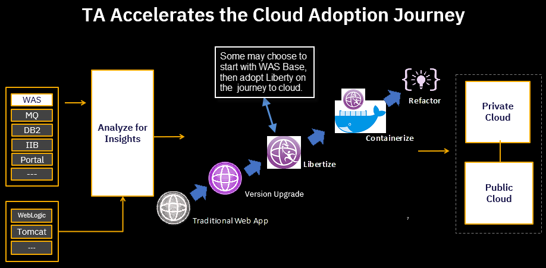

  

## Business Scenario

As illustrated below, your company has a web app called **Mod Resorts**, a WebSphere application showing the weather in various locations. Your company wants to move this application from on-premises (in VMs) to the cloud (in Containers) using **IBM Cloud Pak for Applications**.

This transition delivers improved operational efficiencies for the
application by leveraging scalable cloud capabilities with IBM Cloud Pak for Applications that the enterprise currently enjoys with its cloud native applications.

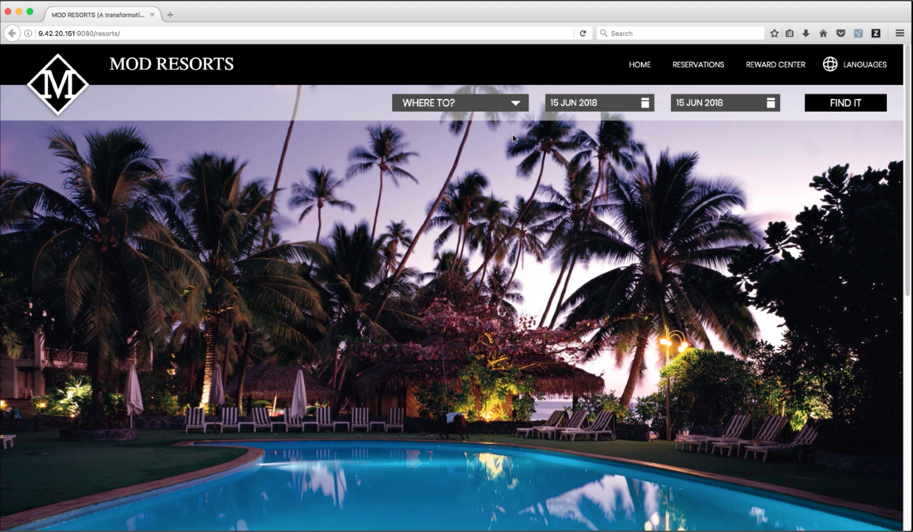

As a tech lead, you have already analyzed the application using **IBM Cloud** **Transformation Advisor.**

Based on the analysis, you know that you can move this application from the traditional WebSphere Server ND cell environment to a containerized WAS Base server environment without any code change. 

Now you are planning to package the application in WAS Base traditional container and to deploy it to an OpenShift Kubernetes cluster environment in **IBM Cloud Pak for Applications**.

By moving an application from a traditional WAS ND cell to a WAS Base container in cloud, you can take advantage of cloud to support application high availability and scalability, minimize application migration effort, reduce on-prem infrastructure and operation cost while leveraging your team’s existing WebSphere admin skills.

  

## Objective

When you have completed this lab, you will:

  - understand how to move a WebSphere app from an on-premises
    environment to the OpenShift cluster without any changes to the app code, while utilizing exiting WebSphere administration skills.
  - learn the process to create a WAS docker container.
  - get familiar with the WAS Base container on OpenShift deployment process.

  

## Prerequisites

The following prerequisites must be completed prior to beginning this
lab:

  - Familiarity with basic Linux commands

The following symbols appear in this document at places where additional
guidance is available.

| Icon                                              | Purpose              | Explanation                                                                                                                                                |
| ------------------------------------------------- | -------------------- | ---------------------------------------------------------------------------------------------------------------------------------------------------------- |
|          | Important\!          | **This symbol calls attention to a particular step or command. For example, it might alert you to type a command carefully because it is case sensitive.** |
|             | Information          | **This symbol indicates information that might not be necessary to complete a step, but is helpful or good to know.**                                      |
|  | **Trouble-shooting** | **This symbol indicates that you can fix a specific problem by completing the associated troubleshooting information.**                                    |

  

## What is Already Completed

Four (4) Linux VMs have been provided for this lab.

  - The OpenShift Container Platform, **OCP v4.2**, included with
    **Cloud Pak for Applications**, is installed in four VMs, the
    **master1** VM, the **dns** VM, the **worker1** VM, with one master node and one compute node.

  - The CLI commands used in this lab are listed in the **Commands.txt** file located at the **/home/ibmdemo/cp4a-labs/lab2b** directory of the Workstation VM. You can use this to **copy / paste** these commands to the Terminal window during the lab.

  

The **Workstation** VM is the one you will use to access and work with **OCP cluster** in this lab.
> The login credentials for the **Workstation** VM are:
> 
> User ID: **ibmdemo**
> 
> Password: **passw0rd**

  

## Lab Tasks

During this lab, you will complete the following tasks:

  - review the **Mod Resorts** app on local WAS server.
  - build a WAS Base server container image.
  - push the WAS Base server container image to OpenShift image
    repository.
  - deploy the WAS Base server container to OpenShift cluster
  - verify WAS server deployment.
  - test and verify the **Mod Resorts** app on WAS container

  

## Execute Lab Tasks

### To get started, login to the environment 

1.  Log in to the Workstation VM and Get Started
    
    a) If he VMs are **not** already
        started, start them by clicking the **Play** button
      > 

    b) After the VMs are started, click the **Workstation** VM icon to
    access it.

      > 
 
The **Workstation** Linux Desktop is displayed. You will execute all the lab tasks on this VM.

  

> The login credentials for the **Workstation** VM are:
> 
> User ID: **ibmdemo**
> 
> Password: **passw0rd**

  

## **Review the on-prem WebSphere application**

In this task, you review the **Modresorts** application deployed to the
local WAS environment. Later, you will move it to a WAS container.

1.  Start WebSphere Application Server

    In the **Workstation** VM, we have a local WebSphere Application> Server which hosts the **Modresorts** application. To start the WAS server:

    a)  Open a terminal window by clicking its icon on the **Workstation** VM desktop tool bar.

    

    b) In the terminal window, issue the command below to start the WAS server (You can ***copy /paste*** the command from the     **Commands.txt** file in **/home/ibmdemo/cp4a-labs/lab2b**  

        /home/ibmdemo/cp4a-labs/shared/startWAS.sh
 
            when prompted, enter the "sudo" user password as: passw0rd
 
    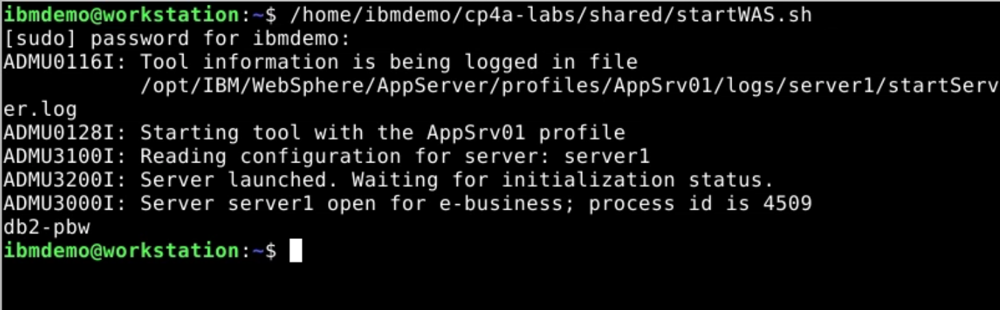

     Within a couple of minutes the WAS server will be started and ready for use.

4.  View the on-prem applications deployed on the WAS server.

    a) Access the WAS Admin Console to view the applications deployed by clicking the web browser icon desktop tool bar to open a browser window.

    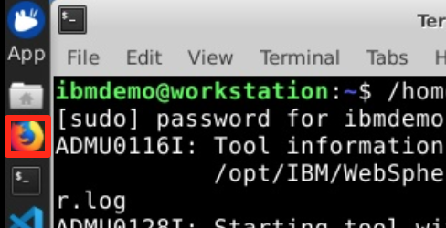

    b) From the web browser window, click **WebSphere Integrated Solution Console** bookmark to launch the WAS console.

    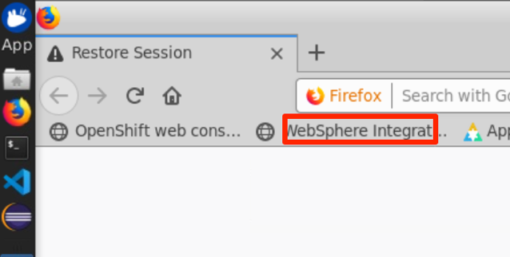

    c) In the WAS Admin Console login page, Login using the following User ID and Password: 

        wsadmin / passw0rd  

    d) On the WAS Console page, click **Applications** -\> **Application     Types** -\> **WebSphere enterprise applications** to view the     applications deployed.

    
 
    In the **Enterprise Applications** list, you can see all applications deployed. The **Mod Resorts** application is in the list, it is the application you are going to move it a WAS container and to deploy it to the OpenShift cluster.

    > 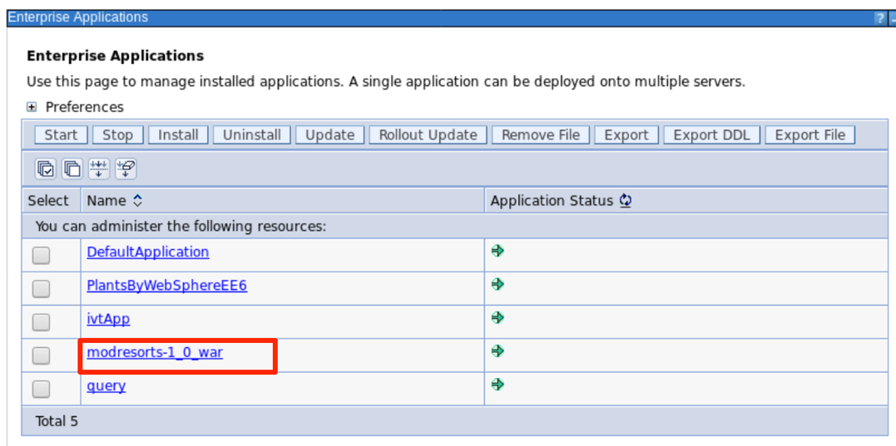

3.  View the **Mod Resorts** application.

    a) From the web browser window, click new Tab to open a new browser window with the **Modresorts** application URL:
    > **http://localhost:9080/resorts/**

    The **Modresorts** application home page is displayed.
 
    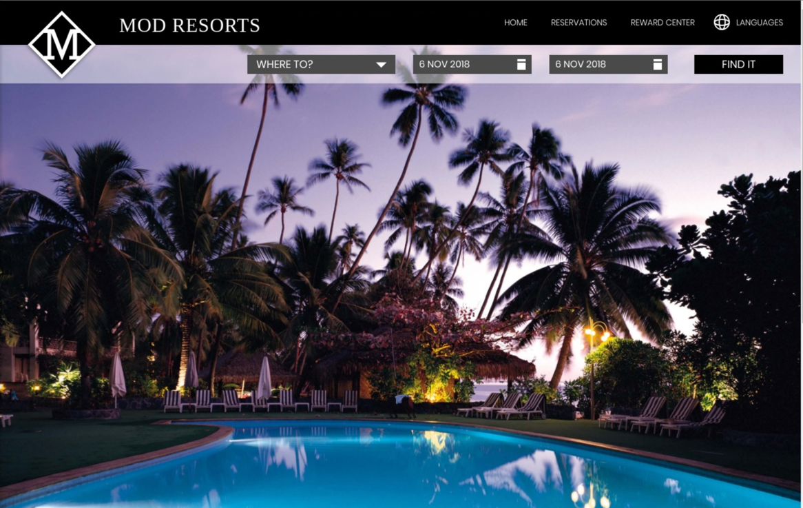

4.  Stop the WAS server by issuing the following command in the Terminal window:

        sudo /opt/IBM/WebSphere/AppServer/profiles/AppSrv01/bin/stopServer.sh server1
 
          when prompted enter the sudo password as **passw0rd**
 
    Then enter the WAS server credentials as: **wssadmin / passw0rd**
 
    > 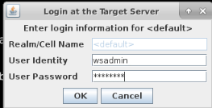
     
    > 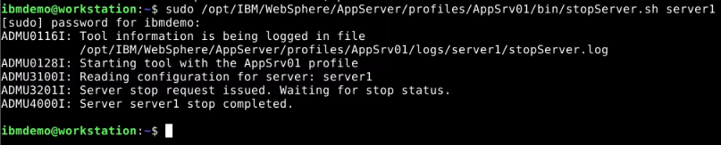
     
    Next, you will learn how to re-platform the application in WAS container without any code change and to deploy it to an OpenShift cluster in IBM Cloud Pak for Applications.

  

### **Build a WAS Base Server Container Image**

In this task, you will build a WAS Base server Docker container image with the **Mod Resorts** application installed.

<table>
<tbody>
<tr class="odd">
<td></td>
<td>
According to Docker’s best practices, you should create a new WAS base image which adds a single application and the corresponding configuration.

You should avoid configuring the image manually (after it is started) vis the Admin Console or wsadmin commands unless it is for debugging purposes. Such changes will not be persisted if you spawn a new container from the Docker image.
</td>
</tr>
</tbody>
</table>

There are five key files you needed to build your WAS Base server
container image:

  - **Dockerfile**: The file defines how the Docker image that has your application and configuration pre-loaded is built
  - **App runtime:** The ear or war file of your application
  - **app-install.props**: The file defines how to install your
    application in the WAS server
  - **appConfig.py:** The WAS admin script in Jython format configures the WAS server for your application
  - **PASSWORD:** The file contains the WAS server console password use in the WAS container

1.  Review Dockerfile, app-install.props file, and appConfig.py files

    a)  From the Desktop tool bar, click the **File Manager** icon to open it.

    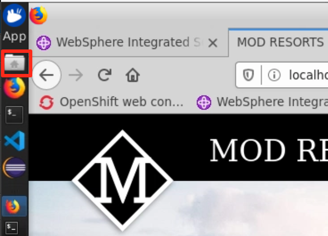

    b) Navigate to **/home/ibmdemo/cp4a-labs/lab2b** directory.

    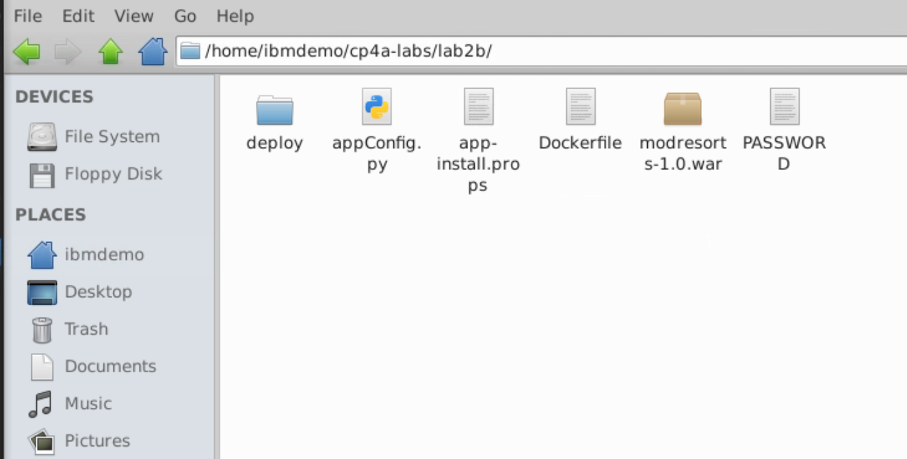

    c) Double click the **Dockerfile** to open it in **Text editor** for reviewing.

    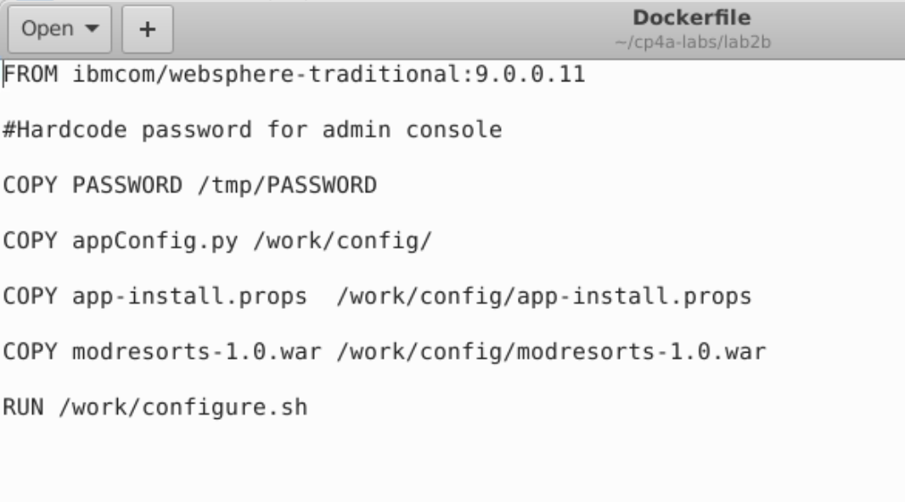

    As you can see, the **Dockerfile** file defines the following activities to create a WAS Base container image:

    - Get the base WAS image from Docker Hub
    - Add WAS admin console password to the WAS Base image
    - Add the WAS server configuration script to the WAS base image
    - Add the application installation script to the WAS base image
    - Add the application runtime file to the WAS base image
    - Run the configuration script to config the WAS server instance inside the container to configure the WAS server and to install the application

    d) Go back to File Manager and double click **app-install.props** file to review it. This is the file that defines the properties for installing the **Modresorts** application to the WAS server instance.

    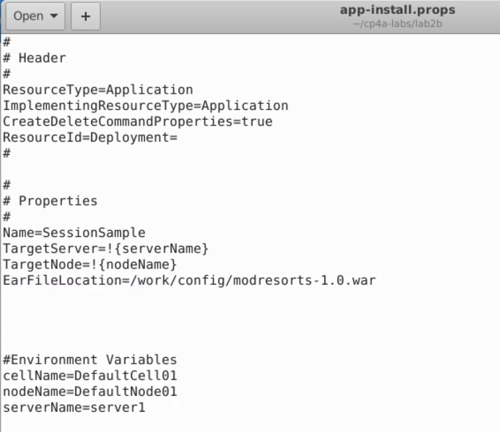
    
    e) In the File Manager window, double click **appConfig.py** file to review its contents.

    > This is a standard WAS admin script with Jython format for configuring WAS to run the **Mod Resorts** application.
    >
    > This is the WAS admin script file you use to convert your application settings, include JDBC and JMS resources, from a WAS ND cell to a WAS Base container.

    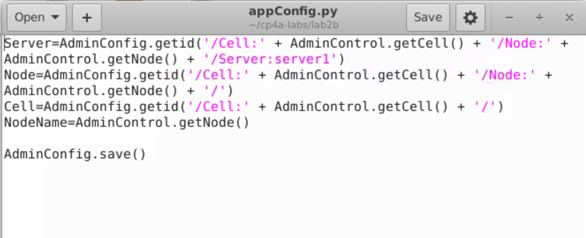

2.  Build the WAS Base server container image

    a) Go back to the Terminal window and navigate to the **/home/ibmdemo/cp4a-labs/lab2b** directory with command

        cd /home/ibmdemo/cp4a-labs/lab2b

    b) Execute the following command to build the WAS Base docker container image using the Dockerfile you just reviewed:

        docker build . -t default-route-openshift-image-registry.apps.demo.ibmdte.net/demo/modresorts-twas:latest
 
    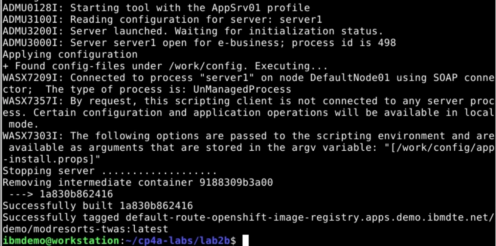
 
    This creates a WAS Base docker image called **default-route-openshift-image-registry.apps.demo.ibmdte.net/demo/modresorts-twas:latest**
 
    Where:
    - **default-route-openshift-image-registry.apps.demo.ibmdte.net** is the OpenShift image registry Push URL
    - **demo** is the OpenShift namespace
    - ***modresorts-twas:latest** is the image name

    c) After the docker container image is created, you can issue the command below to verify the docker image was created:

        docker images | grep twas
 
    You see the docker image is created.

    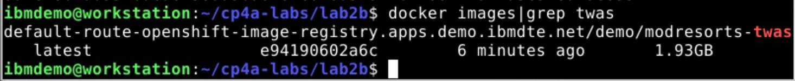

    d) To verify the docker image and the application, create and run a local container called **modresorts-twas** with the command below:

        docker run --name modsorts-twas -p 9443:9443 -d default-route-openshift-image-registry.apps.demo.ibmdte.net/demo/ modresorts-twas:latest
 
Once the container is created, you can test the **Moderesorts** application by launching it in a web browser window with the URL: [**https://localhost:9443/resorts**](https://localhost:9443/resorts)

At this point, you have built the Docker container and tested the
ModResorts application in the local docker environment.

Next, you will push the Docker image to the OpenShift image registry and
deploy the application to the RedHat OpenShift cluster in the lab
environment.

  

## **Push the WAS Container Image to OpenShift Image Registry**

After the WAS container image is built, you need to push it to an image registry. In this lab, you are using the OpenShift Image Registry to host your WAS container image.

1.  From the Terminal window, issue the command below to login to the OpenShift cluster.

        oc login -u admin -p passw0rd

2.  Create a new OpenShift project (namespace) called **demo** to host the image

        oc new-project demo
 
    > 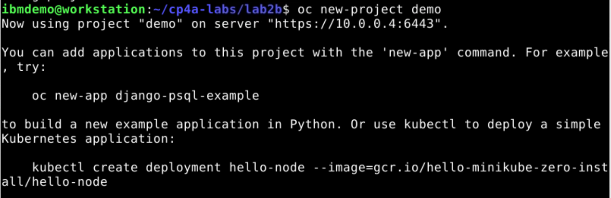

3.  Execute the following commands to login to the OpenShift image
    repository and to push your docker image

        docker login -u admin -p $(oc whoami -t) default-route-openshift-image-registry.apps.demo.ibmdte.net

        docker push default-route-openshift-image-registry.apps.demo.ibmdte.net/demo/modresorts-twas:latest
 
    > 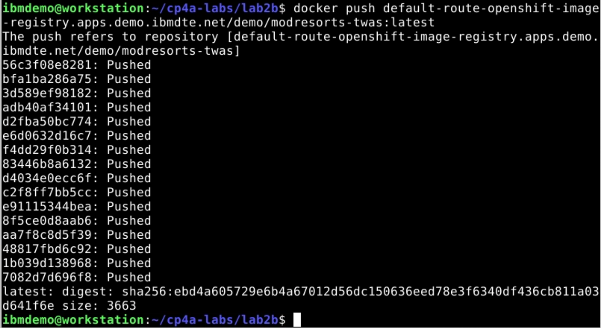

4.  Verify the pushed Docker image was successful pushed to the
    OpenShift image repository.

    a) Click the web browser icon on the desktop toolbar to go back to the browser window.

    b) Click **OpenShift web console** bookmark to open the **OCP**  console.

    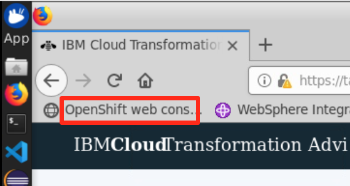
    
    c) The **OCP** web console login page is displayed. Click the
    **kube:admin** login link
 
    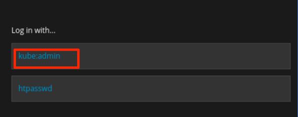
    
    d) Click to select **kubeadmin** username and click **Log In**.

    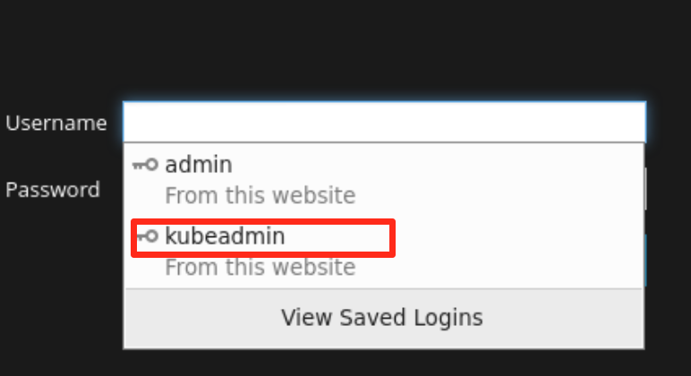
    
    The **OCP** **Web Console Home** page is displayed.

    e) From the **OCP** **Web Console Home** page, click **Builds \> Images Streams** from the menu

    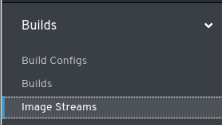

    f) Using the Drop-Down menu, change project (namespace) to **Project: demo**

    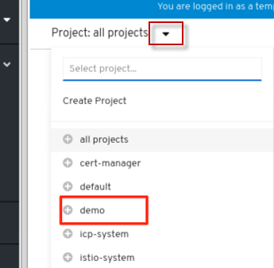

    g) You can see the image you just pushed is listed as an available Image Streams

    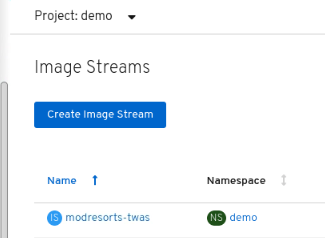

    h) Click the **modresorts-twas** Image Stream link to view its details.

    > 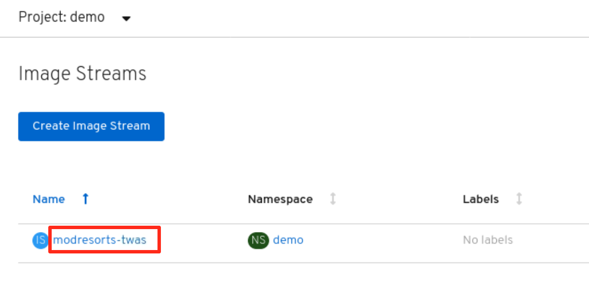
 
    In the **Image Stream Details** Page **Overview** section, you will see the public image repository you used to push the image.

    Notice that the public image repository is mapped to an internal image repository which will be used to deploy the application.

    The internal image repository is: **image-registry.openshift-image-registry.svc:5000/demo/modresorts-twas**

    > 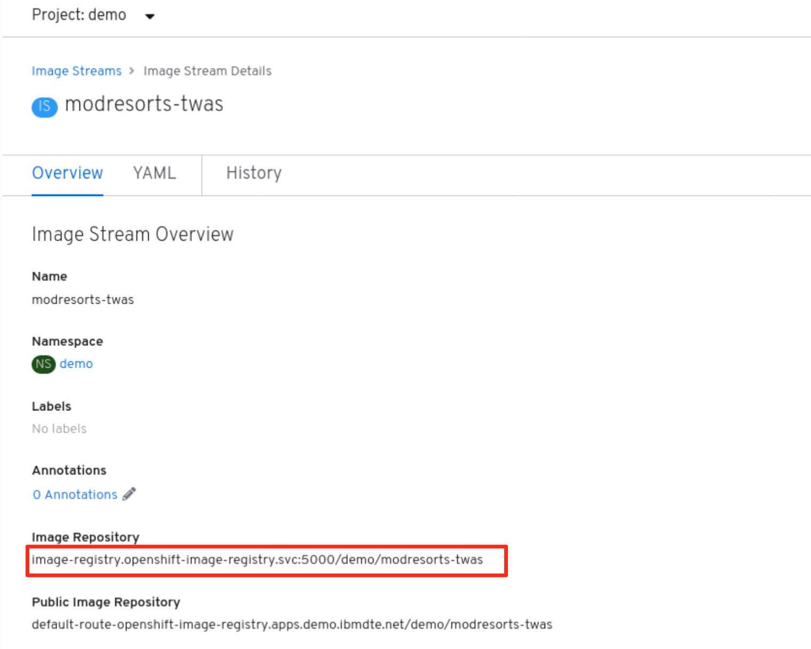

  

## **Deploy the WAS Container to OpenShift Cluster**

Now that the WAS container image is available in the OpenShift image registry, you will deploy the WAS container to the OpenShift cluster using the OpenShift “**oc**” CLI.

Kubernetes resource files (YAML) are needed to deploy the application to OpenShift (Kubernetes Cluster). Take a moment to review the deployment resources used in the lab.

1.  View the deployment YAML files. In this lab you are going to use three YAML files to deploy the WAS container, these files are:

    - **deploy.yaml** – create a WAS container in the OpenShift cluster
    - **service.yaml** – create a service to expose the WAS container
    - **route.yaml** – create a route to access the WAS container service

    a) From the **File Manager** window, navigate to **/home/ibmdemo/cp4a-labs/lab2b/deploy** directory where these three YAML files are located.

    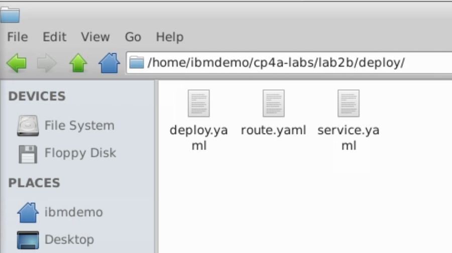

    b) Double-click the **deploy.yaml** file to open it in the text editor.

    The file contains the basic requirements of the WAS container deployment. The container name is set as **modresorts-app-twas** and it is deployed to the **demo** namespace.

    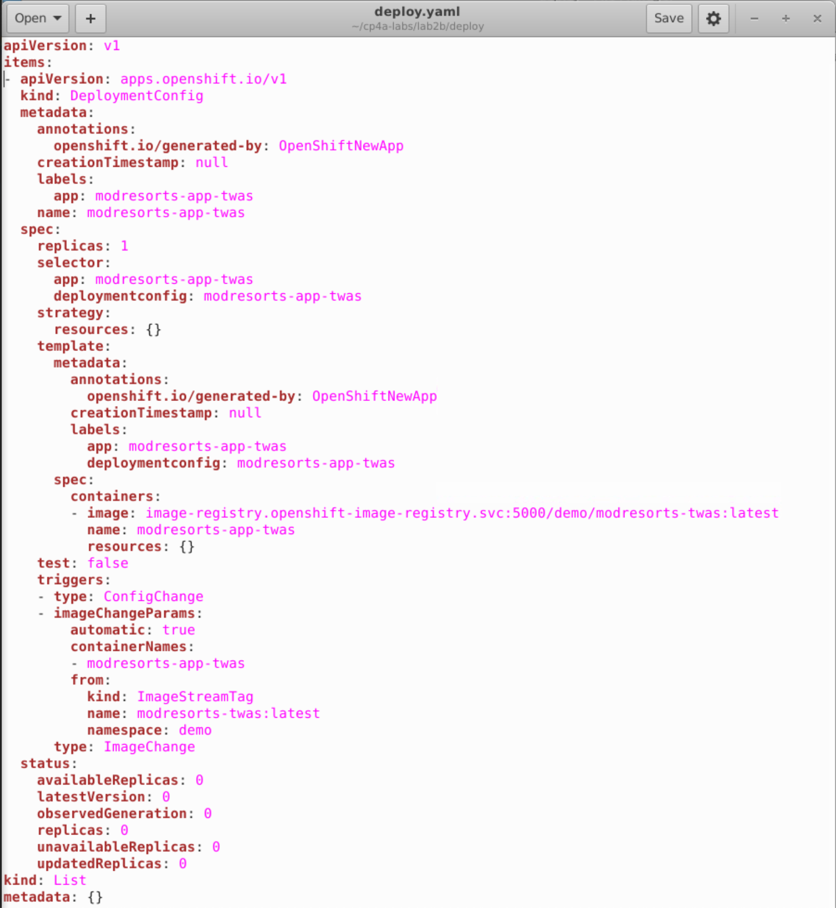

    c) Double-click the **service.yaml** file to view its contents.

    The file exposes the **Modresorts** application ports **9080** and **9443**. The port type in the OpenShift cluster is set as **ClusterIP**.

    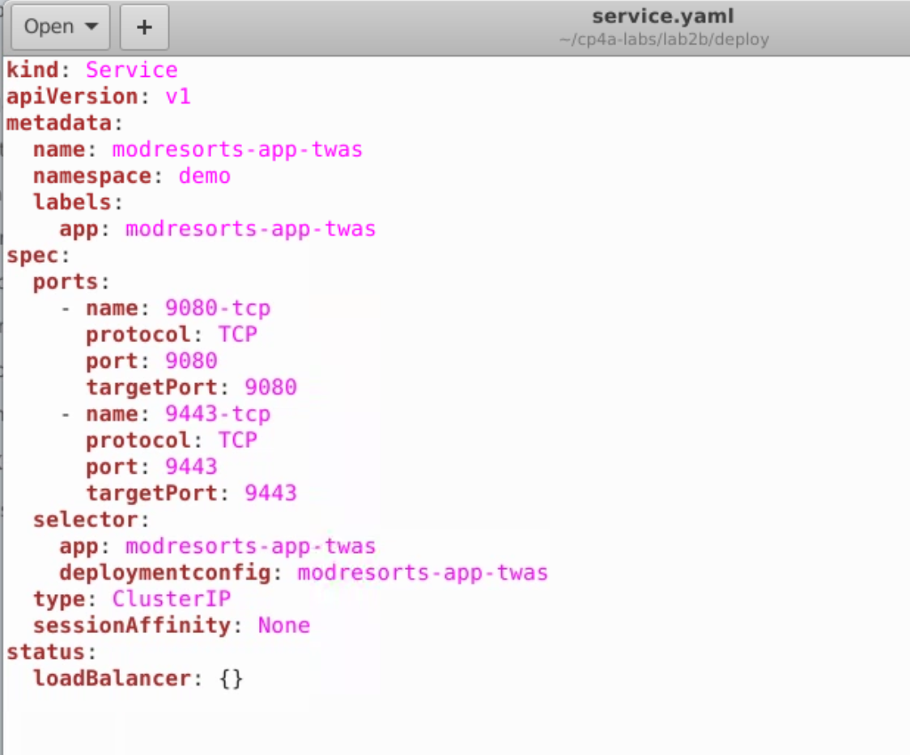

    d) Double-click the **route.yaml** file to view its contents.

    The file defines the OpenShift route used for the WAS container as **modresorts-app-twas.apps.demo.ibmdte.net** which enables users to access the **Modresorts** application on a public address.

    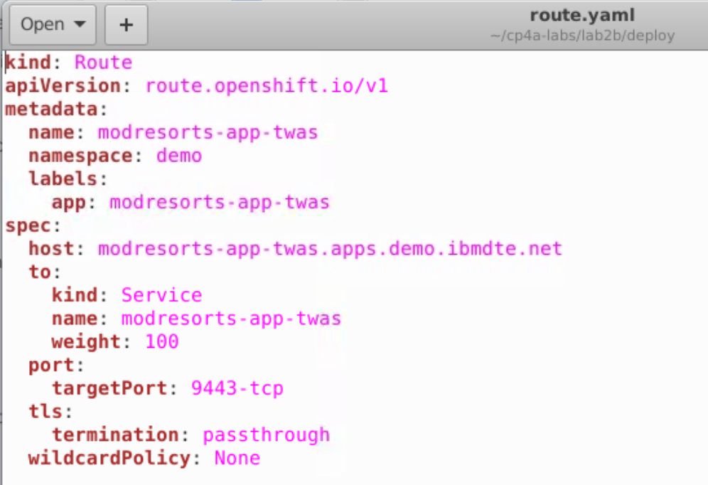

2.  Deploy the WAS container to OpenShift cluster using the deployment YAML files that you reviewed.

    a) From the Terminal window, change to the **/home/ibmdemo/cp4a-labs/lab2b** directory

        cd /home/ibmdemo/cp4a-labs/lab2b

    b) Issue OpenShift CLI command to deploy the WAS container to the OpenShift cluster

        oc apply -f deploy
 
    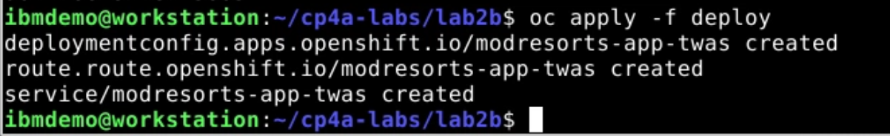
 
    The command deploys the resources defined in the three YAML files in the **deploy** directory and create WAS container pod, service, and route in the **demo** namespace.

 

Next, you will verify the deployment of the ModResorts application running in OpenShift

  

## **Verify the Deployment**

In this task, you access the OpenShift Web Console to verify the WAS container deployment

1.  Go back to the **OpenShift Web Console**, click **Workloads \>
    Pods**, then select **demo** project from the project list, if it not already selected.

    > 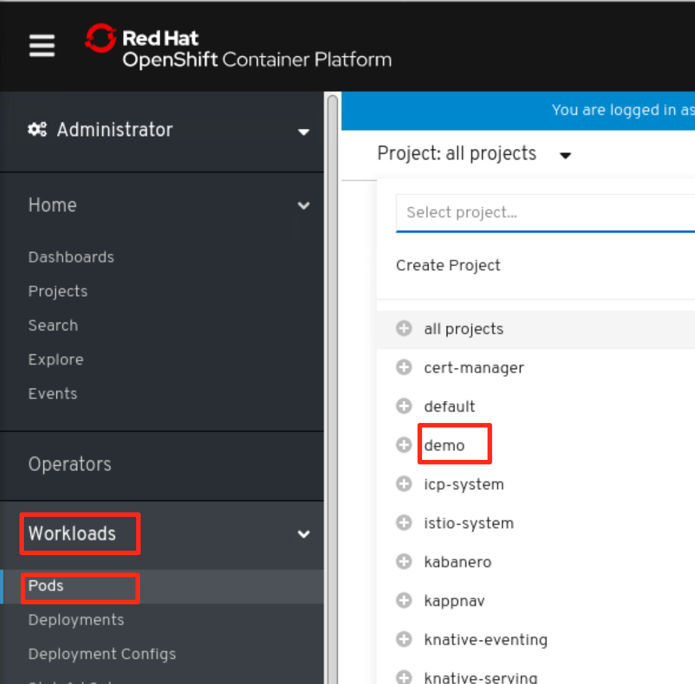

2.  You will see that the WAS container is deployed and is in    **running** status.

    > 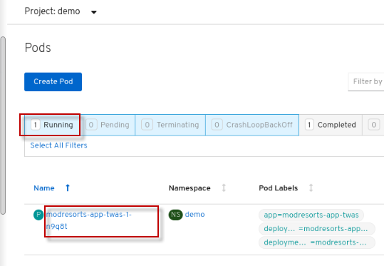

3.  Click the modresorts pod link to go to its **overview** page where you can see its memory and CPU usage, among other detail information.

    > 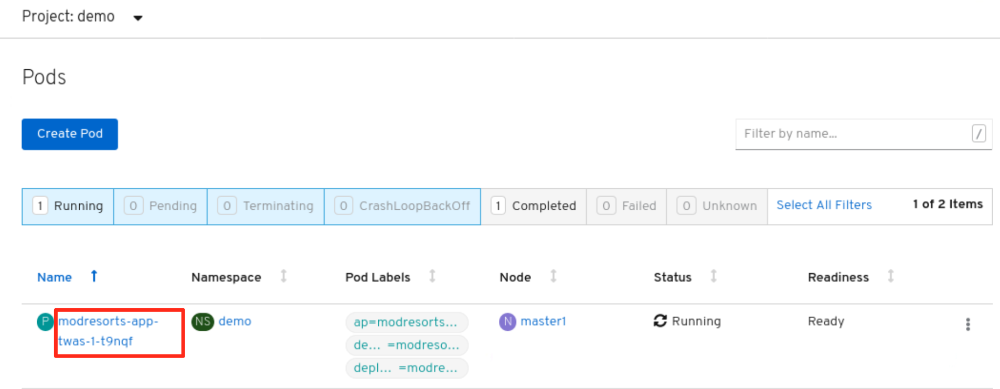

4.  Now from the **OpenShift Wen Console** navigation panel, click
    **Networking \> Services**. You will see the WAS container
    **service**. Click the service name to view its details.

    > 

    In the Service Details page, you can see the service ports as you defined in the **service.yaml** file.

    > 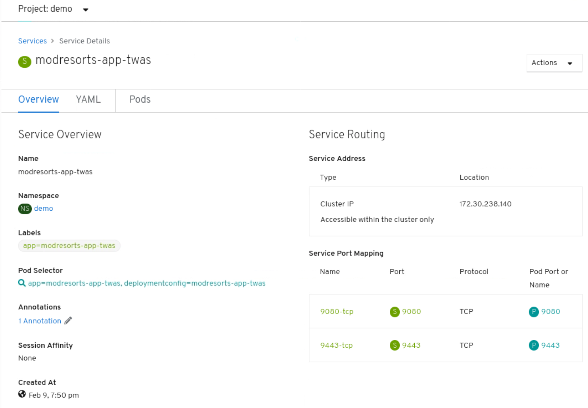

5.  Next navigate to **Networking \> Route** to view the WAS container service route. Click the **Location URL** to launch the  **Modresort** application.

    > 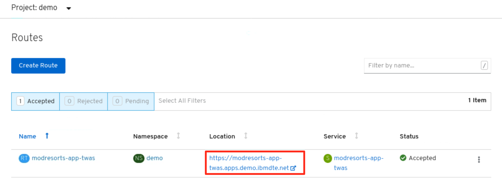

6.  Type the **Modresorts** application context root **resorts** in the end of the URL and press **Enter**.

    The full URL is: <https://modresorts-app-twas.apps.demo.ibmdte.net/resorts>

7.  The **Modresorts** application home page is displayed.

    > 

**Congratulations\! You have successfully completed *App Modernization using WAS Base Container on OCP Lab\!***

  

## Summary

In this lab, you learned the App Modernization re-platform process to move an existing traditional WAS application to WAS Base container and to deploy it to an OpenShift cluster without any code change.

[IBM Cloud Pak for Applications](https://developer.ibm.com/components/cloud-pak-for-applications/), built on the Red Hat® OpenShift® Container Platform, provides a long-term solution to help you transition between public, private, and hybrid clouds, and to create new business applications.

As a key component of **IBM Cloud Pak for Applications**, traditional WebSphere application Server can still run in containers, and reap the benefits of consistency and reliability that containers provide.
