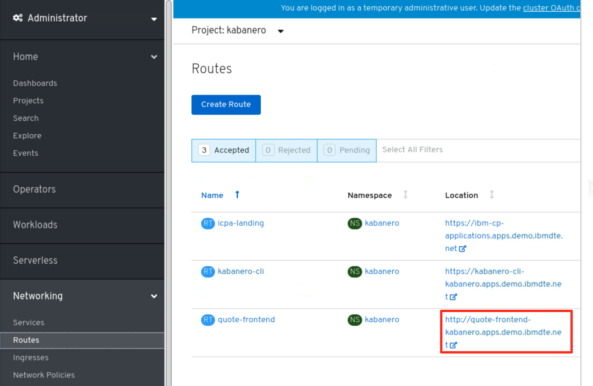

# ITC-21

# Create and Deploy a Cloud Native App to IBM Cloud Pak for Applications (CP4Apps)

<br> 

## Lab: Create and Deploy an Insurance Quote App to OpenShift with IBM Cloud Pak for Applications

On the journey to cloud, enterprise customers are facing challenges
moving their existing on-premises applications to cloud and creating
cloud native business applications quickly and cost-effectively. The
**IBM Cloud Pak for Applications** (CP4Apps) provides a complete and
consistent experience and solution to modernize enterprise applications for cloud-native deployments. Customers can easily modernize their existing applications with IBM’s integrated tools and develop new cloud-native applications faster for deployment on any cloud.

One of the features included in the Pak is ‘Accelerators for Teams’, a modern microservices-based framework that enables developers, architects and operation teams to work together, faster on end-to-end solutions for the team to build, deploy, and manage the lifecycle of Kubernetes-based applications on OpenShift Container Platform.

Accelerators for Teams provides Application Stacks, Pipelines for modern DevOps and Developer Tools. These features are derived from Kabanero, an open source project that integrates many open source projects and is the upstream project for Cloud Pak for Applications.

You can get starting using only open source with Kabanero and try out
capabilities in Cloud Pak for Applications. Learn more at <https://kabanero.io>

For more information about IBM Cloud Pak for Applications, please visit [Cloud Pak for Applications](https://www.ibm.com/cloud/cloud-pak-for-applications).

In this lab you will first learn how to develop a cloud-native
microservice application using pre-built Application Stacks, customized for your enterprise. You will use a local iterative dev experience with a CLI to rapidly develop a microservice with a pre-built Application Stack and deploy to Red Hat OpenShift. The Appsody CLI will be used.

Then you will learn how to use different stacks to develop microservices applications and deploy the applications to Red Hat OpenShift using different techniques including Kubernetes-native
pipelines based on an open source project called Tekton from the
Continuous Delivery Foundation. This provides the preferred and governed way applications should be verified, built and deployed to OpenShift clusters consistently.

As shown in the diagram below, Application stacks (built using Appsody) simplify the process of building and deploying applications to OpenShift for both modernized and new cloud-native apps.


<br> 

## Business Scenario

The lab covers the following business scenario:

Your company is developing a cloud native microservice application to
provide new insurance quote services to your customers. The application consists of a frontend web UI service application and a backend REST application.


Your team architect has designed to use a **Node.js Express** stack for the web application and to use the Spring Boot stack for the backend application.

He has made these available to developers in a local Hub called a
“**Collection Hub**” which brings together the **Customized Application Stacks** and the **Pipelines** that control build and deployment consistency on the enterprise’s OpenShift cluster.

As a developer, you will configure your developer tools to this Local
Hub to create the cloud native applications using the customized
Application Stacks (nodejs-express and spring boot) that meets your
enterprises standards and multi-disciplinary team’s decisions. You will then deploy them to the OpenShift Container Platform.

<br> 

## Objective

The objectives of this lab are to:

  - Learn how to use the Appsody CLI to create cloud native microservice applications with Application Stacks.
  - Learn how to deploy microservice applications to OpenShift using
    pre-built yet customizable Pipelines that are Kubernetes-native,
    based on an open source project called Tekton.

<br> 

## Prerequisites

The following prerequisites must be completed prior to beginning this
lab:

  - Familiarity with basic Linux commands
  - Have internet access
  - Have a GitHub account. If you do not have it yet, you can sign up
    for a free account at: [https://github.com](https://github.com/)

The following symbols appear in this document at places where additional
guidance is available.

| Icon                                              | Purpose              | Explanation                                                                                                                                                |
| ------------------------------------------------- | -------------------- | ---------------------------------------------------------------------------------------------------------------------------------------------------------- |
|          | Important\!          | **This symbol calls attention to a particular step or command. For example, it might alert you to type a command carefully because it is case sensitive.** |
|             | Information          | **This symbol indicates information that might not be necessary to complete a step, but is helpful or good to know.**                                      |
|  | **Trouble-shooting** | **This symbol indicates that you can fix a specific problem by completing the associated troubleshooting information.**                                    |

<br> 

## What is Already Completed

Four (4) Linux VMs have been provided for this lab.


  - The OpenShift Container Platform, **OCP v4.2**, included with
    **Cloud Pak for Applications**, is installed in four VMs, the
    **master1** VM, the **dns** VM, the **worker1** VM, with one master
    node and one compute nodes.

  - The IBM **Cloud Pak for Applications** has been deployed to the
    **OCP cluster**. For information on how to install IBM **Cloud Pak
    for Applications** on OpenShift, please visit:
    <https://www.ibm.com/support/knowledgecenter/SSCSJL_4.x/welcome.html>

  - Appsody client (v0.5.4) is installed on the **Workstation VM**.

<table>
<tbody>
<tr class="odd">
<td><blockquote>
<p></p>
</blockquote></td>
<td><blockquote>
<p>The CLI commands used in this lab are listed in the <strong>Commands.txt</strong> file located at the <em><strong>/home/ibmdemo/cp4a-labs/lab8 directory of the Workstation VM.</strong></em></p>
<p><em><strong>You can use theses commands to copy and paste commands to the Terminal window during this lab.</strong></em></p>
</blockquote></td>
</tr>
</tbody>
</table>

The **Workstation** VM is the one you will use to access and work with **OCP cluster** in this lab.
> 
> The login credentials for the **Workstation** VM are:
> 
> User ID: **ibmdemo**
> 
> Password: **passw0rd**
> 
> **Note:** Use the Password above in the **Workstation** VM Terminal
> for ***sudo*** in the Lab

<br> 

## Introduction to Application Stacks built using Appsody: How does it work?

**Application Stacks** built using Appsody, an open source project, use the well-known **Dockerfile syntax** to specify which language runtimes, frameworks, libraries, and tools are included. **Project templates** build upon these stacks, providing developers with a templatized starter application to bring into their IDE of choice and begin development.

Developers run, debug, or test their application using a CLI from
Appsody. It starts a container with the stack image, makes the
development workspace available to the running container, and starts the Appsody controller. The controller is configurable through environment variables in the stack and manages the application within the running container.

For example, the controller can watch for changes in the application
/src directory. When these changes are saved, the controller restarts
the application running in a docker container.

**Application Stacks**, built using Appsody, are configurable technology stacks with popular runtimes and frameworks. Two examples are: *Java with Eclipse MicroProfile* using Open Liberty and *Node.js with Express*.

These stacks provide the foundation for building applications that can be deployed and managed effectively on OpenShift. Stacks allow for rapid development, whilst giving the stack provider the ability to control how the applications are composed.

Building a new or modifying an application stack is similar to creating a custom Cloud Foundry build pack. We are building an enterprise curated application container that provide tools and a Docker (CRI-O) container that will be used to build a specific application kind (e.g., java-microprofile, spring-boot2, node.js-express, etc.).


### Stack Hubs

The **Stack Hub** is the central point of control for Application
Stacks, built using Appsody, where you can find available stacks, create new stacks, or modify existing ones.

You can use the Hub content in the **public repo** or clone it to
provide a private Hub that's based on your requirements. By making
changes to the Stacks in the Hub, you can deploy updates to any
application that's been built on them, simply by restarting the
application.

**Collections** are simply an Application Stack and the Pipelines
required to deploy them. A Collection Hub is a Stack Hub plus additional folder structures that store pipelines for build and deployment.

When CP4Apps is installed, it is the solution architect’s role to define and customize the Application Stacks made available to developers. This is a multi-disciplinary process where Developers, Cloud Operators and Solution Architects come together and agree on choices to codify in the Application Stack and Pipelines. These customizations are done in the Local Hub in their private Git Hub Enterprise or Git Lab deployment.

Stack images are copied into a Local Registry where they are used to
ensure image builds occur in consistent and governed manner, when
deploying through pipelines onto remote OpenShift clusters.

For lab simplicity, we’ll start with an application stack that is
provided by the **Appsody open source community**.

<br> 

## Lab Tasks

During this lab, you will complete the following tasks:

  - create native applications using Application Stacks based on
    Appsody.
  - modify the applications with insurance quote business logic
  - Use Appsody CLI to build, deploy, and validate the front-end
    application locally in containers
  - deploy the quote frontend application to OpenShift using a CI/CD
    pipeline based on Tekton.

In this lab you'll be doing everything via the command line so that you can understand the steps in detail.

If you are using an IDE like **VisualStudio Code**, **Eclipse**, or the **hosted Eclipse Che IDE** (CodeReady Workspaces on OpenShift), the **Eclipse Codewind extension** provides the same function to create, run, debug, and test these applications without using the command line or leaving the IDE.

<br> 

## Execute Lab Tasks

1.  Log in to the Workstation VM and Get Started
    
    a) If he VMs are **<span class="underline">not</span>** already
        started, start them by clicking the **Play** button
      > 

    b) After the VMs are started, click the **Workstation** VM icon to access it.

      > 
 
The **Workstation** Linux Desktop is displayed. You will execute all the lab tasks on this VM.

If requested to login to the OS, use credentials: **ibmdemo** /**passw0rd**

<br> 

## **Add the Collection Hub repo to Appsody**

Appsody uses sharable technology stacks for rapid development of quality microservice-based applications. Each Application Stack is
pre-configured with popular open source technologies. Application Stacks include a base container image (UBI from Red Hat for all Stacks in CP4Apps) and project templates which act as a starting point for your application development.

In this task, you will add the local Collection Hub built by the
enterprises Solution Architect to Appsody.

1.  From the **Workstation** desktop, open a Terminal window by clicking its icon on the Desktop Tool Bar.

    

2.  In the **Terminal** window, issue the following command to add the Collection Hub to the local Appsody repo list:

        appsody repo add kabanero https://github.com/kabanero-io/collections/releases/download/0.3.5/kabanero-index.yaml

        Where kabanero is the collection repo name

3.  The **kabanero** repo is now added to Appsody. To verify it, issue command:

        appsody repo list

     The command returns the list of repos in the collection 

    > 

4.  To view the available stacks included in the kabanero repo, run the following command:

        appsody list kabanero

    This will give you a list of the available stacks.

    Notice that the kabanero repo contains Application Stacks for specific versions of Nodejs, Springboot, Microprofile.

    > 

5.  Set the **kabanero** repo as the default Appsody repo with command:

        appsody repo set-default kabanero

The default Appsody repo is now set. You will use the **nodejs-express** stack to develop the insurance quote front-end application.

<br> 

## **Create the frontend application and run it locally**

The frontend application is written in Node.js Express. First let's
initialize a new project that uses the Node.js Express stack.

1.  In the terminal window, create a directory named **quote-frontend**. Create a new node.js application using **appsody init** command shown below:

        mkdir /home/ibmdemo/quote-frontend
        
        cd quote-frontend
        
        appsody init kabanero/nodejs-express

    The new node.js application is now successfully initialized, as illustrated below.
 
    > 

2.  After the **appsody init** command completes, launch Visual Studio Code (VS Code) editor with the command below to view the content of the directory.

        code .

    The Application Stack has a simplified project structure on disk.

    Note that this project doesn't contain a Dockerfile, Node, Express, or many of the other files that you might expect in a cloud-native  Express project.

    With Application Stacks built using Appsody these files - along with many best practices and opinionated decisions are provided by the stack, resulting in automatically following best practices and a much simpler view for the developer.

    > 
 
    Here is an example of what’s included in an Application Stack:
 
    > 

3.  In this lab, you are going to replace the starter code created in
    the init process with the insurance quote frontend application code.

    a) First, edit the **package.json** file and add the following to the dependencies section:

    ````
    "dependencies": {
    "body-parser": "^1.19.0",
    "config": "^3.2.0",
    "express-validator": "^6.2.0",
    "pug": "^2.0.0",
    "request": "^2.88.0"
    ````
    
    Refer to the screen shot below to see where to place the text in the **package.json** file.

    > 

4.  Click **File \> Save All** to change the change

5.  Then, **Exit** VS Code.

6.  Now, from the Terminal window, copy the insurance quote frontend
    application code files from the **/home/ibmdemo/cp4a-labs/lab8/exercise-frontend** directory to your Appsody project:

        cp -R /home/ibmdemo/cp4a-labs/lab8/exercise-frontend/* .

    The resulting directory structure of your project is illustrated below:

    > 

7.  Stop Transformation Advisor Docker container that is running on port 3000, which conflicts with Appsody. This is just to work around our lab environment configuration.

        /home/ibmdemo/ta-local/transformationAdvisor/scripts/stopTransformationAdvisor.sh

8.  Start the application locally, using the following command:

        appsody run

9.  You can see the output of the application by launching **a web
    browser window** and navigating to **http://localhost:3000**

    The Insurance Quote form is displayed, as illustrated below
 
    > 

10. You can fill in the form and hit the button to submit it and a
    response will appear like this:

    > .
 
    **Note:** In this case, the frontend application is **not** sending a request to the backend application. Instead it is configured to use a mock endpoint for testing purposes in development mode. This works as follows.

    - quote.js uses the config module to get the value for the backend URL.
    -  When the application runs in development mode, the config module uses config/development.json to find the value for the backend URL.

    This file sets the URL to the mock endpoint in the **config/development.json** file.
 
    > **{**
    > 
    > **"backendUrl": "http://localhost:3000/quote/test"**
    > 
    > **}**

    When the application runs in production mode (which we will see later), the config module uses **config/custom-environment-variables.json** file to find the value for the backend URL.
 
    This file sets the URL from the **BACKEND\_URL** environment variable.

    > **{**
    > 
    > **"backendUrl": "BACKEND\_URL"**
    > 
    > **}**

11.  Go back to the Terminal window and enter **Ctrl+C** to stop the
    application.

12.  **Exit** the VS Code UI, if it is still open


**Congratulations\! You have successfully used capabilities built into IBM Cloud Pak for Applications to create, build, and deploy a cloud native application in a local containerized environment.***

In the next section, you will leverage the out-of-the-box Pipelines
included with IBM Cloud Pak for Applications to build, scan, and deploy the cloud- native application to OpenShift.

**More information on Appsody, an Open-Source project under the
Kabanero Open-Source project:**

Appsody documentation on CLI commands:
<https://appsody.dev/docs/using-appsody/cli-commands/>

Appsody documentation for Testing stacks:
<https://appsody.dev/docs/stacks/test>

<br>

## Let’s recap what we have done so far

  - First, you **created** a new local collection hub based on a public collection hub
  - You listed the available application stacks in the local collection hub
  - You made your “kabanero” stack the default stack in the local
    collection hub
  - You **initialized** the “nodejs-express” application stack in the
    dev.local repo
  - You used Appsody CLI to “**run**” the “front-end” nodejs-express
    application locally in containers, using Appsody CLI. This also
    built the application using the out-of-the-box-resources in the
    stack.
  - Finally, you used the web browser to test the “front-end”
    nodejs-express application stack from the kabanero collection.

<br>

## **Deploy the quote-frontend application to OpenShift with the CI/CD Pipeline**

In this section, you will deploy the **frontend** application to
OpenShift.

You will use a Pipeline based on Tekton to deploy the application in a controlled and secure manner onto the OpenShift Container Platform.

**Note:** Tekton is the Open-Source upstream project for RedHat
OpenShift Pipelines.

Enterprise solution architects generally will work with Cloud Operators who manage OpenShift production clusters and developers to create **approved pipelines** with steps that meet their enterprise’s needs.

1.  Navigate to your quote-frontend directory. We first create the
    deployment yaml as follows:

        cd /home/ibmdemo/quote-frontend

        appsody deploy --generate-only

    This creates a file named **app-deploy.yaml** in your project folder. It will take a couple of minutes for the task to complete.

    > 

    On-line documentation for Appsody deploy: <https://appsody.dev/docs/cli-commands/#appsody-deploy>

2.  Now we need to tell the frontend application how to talk to the
    backend application.

    The frontend will look at an environment variable **BACKEND\_URL** to find the address of the backend, so we will set this in the application Custom Resource (CR).

    a) Exit VS Code UI, if it is still running.

    b) Then, relaunch VS Code from the current directory of your **quote-frontend** app:

        code .

    c) From the VS Code edit, open the **app-deploy.yaml** file and add the following section as shown below:

    ````
    env:
    - name: BACKEND\_URL
      value: <http://quote-backend:8080/quote>
    ````

    <table>
    <tbody>
    <tr class="odd">
    <td></td>
    <td><p><strong>Notes:</strong></p>
    <p><strong>a. Your line numbers may be different if the template code has changed since the screenshot.</strong></p>
    <p><strong>b. This is yaml file, so indentation matters. And No TABS!</strong></p></td>
    </tr>
    </tbody>
    </table>

    

    d) Save the change by clicking **File \> Save All**

    e) **Exit** VS Code.


3.  Create a **Git repo** for the application. You will push the     application to your GitHub repo.

    <table>
    <tbody>
    <tr class="odd">
    <td></td>
    <td><p>This step requires that you have a public GitHub account.</p>
    <p><strong>If you do not have a GitHub account, create a free account at: <a href="https://github.com">https://github.com</a></strong></p></td>
    </tr>
    </tbody>
    </table>

    a) From the web browser window, click the **GitHub bookmark** to launch it.

    

    
    b) Log in to your existing GitHub account. If you do not have one,  you can sign up to get a free account.

    c) From your GitHub page, click **Add\>New repository** to create a new repo.

    

    d) Enter the **Repository name** as **quote-frontend,** select the  **Public** option and click **Create repository.**

    > 

    e) Your repository is created. Write down the GitHub repo URL link of the repository, you are going to use it later.

    

    f) From the Terminal window, push your application code to the Git repo, using the following commands:

        cd /home/ibmdemo/quote-frontend
        
        git init
        
        git add .
        
        git commit -m "first commit"
        
        git remote add origin https://github.com/<your Github User Name>/quote-frontend.git

          Note: where <your Github User Name> is your GitHub user name.

        git push -u origin master
          
          Note:  When prompted, enter your GitHub username and password


4.  Refresh your GitHub Repo and verify the contents have been published
    to the quote-frontend repo

    > 

<br> 

## Add the Pipeline resources to OpenShift

1.  Login to the OpenShift Cluster

        oc login -u admin -p passw0rd

2. Set up a project namespace.

    OpenShift applications are deployed within a project. The first step in the deployment process is to create a new or select an existing project. In this lab, we are going to use an existing project called **kabanero**. From the Terminal window, issue the following commands:

    oc project kabanero

    **Note:** You are now working in the “**kabanero**” project in OpenShift.

3.  Create a new Tekton pipeline CR. (Kubernetes Custom Resource)

    <table>
    <tbody>
    <tr class="odd">
    <td></td>
    <td><p>Note: In general, developers don’t create the pipelines. They should be setup for them with all the tasks their solution architect and cloud operator teams require.</p>
    <p>In this lab, you will act as the operator to set the pipeline CR and get familiar with the process.</p></td>
    </tr>
    </tbody>
    </table>

    a) Copy the sample pipeline CR file **pipeline-resources.yaml** from /home/ibmdemo/cp4a-labs/lab8/exercise-frontend/ directory to /home/ibmdemo/quote-frontend directory, using the following commands:

        cd /home/ibmdemo/quote-frontend

        cp /home/ibmdemo/cp4a-labs/lab8/exercise-frontend/pipeline-resources.yaml .

    b) Return to the VS Code editor, or launch it, if it is not running.

        code .

    c) Click **pipeline-resources.yaml** file to open it, change the GitHub user to your Github username

    

    d) Click **File \> Save All** to save the change.

    e) **Exit** VS Code

    f) Deploy the pipeline resource to the OCP cluster **kabanero** namespace, using the following commands:

        cd /home/ibmdemo/quote-frontend

        oc apply -f pipeline-resources.yaml -n kabanero

    

<br> 

## Deploy the quote-frontend application to OpenShft using the Tekton Piepline

1.  Access the Tekton Dashboard to setup the PipelineRun

    In order to provide control and consistency at scale, all build and deploy steps must go through the pipeline. So, in an enterprise setting, webhooks would be setup by the operations or solution architect that monitor the developers Git repos and trigger the PipelineRun during commit/push actions.

    Due to network connectivity limitations with the lab infrastructure, we are asking you to create a manual PipelineRun to simulate the webhook completing that step, enabling the rest of the lab flow to continue.

    a) Go back to the web browser window and launch the **Tekton Dashboard** by clicking its bookmark.

    

    b) Click **Log in with OpenShift** to continue

    

    c) In the login page, click **kube:admin** field, select the **kubeadmin** user name and **click Log in**.

    |                                |                                                                                                |
    | ------------------------------ | ---------------------------------------------------------------------------------------------- |
    |  |  |

2.  Create the PipelineRun and Run the Pipeline to deploy the
    application.
    
    a) From the **Tekton Dashboard** page, you can click the **Pipelines** link to view all available pipelines, or you can click **PipelineResources** to view the two resourced you just created.

    

    b) We are going to use the **PipelineRun** button to deploy the quote-frontend application, so click **Create PipelineRun** in the **PipelineRuns** page.

    

    c) In the **PipelineRun** page, set the parameters as shown in table below. Then click **Create**.

    **Note:** Refer to the screenshot below the table, if additional clarity is needed for input parameters.

    | Namespace       | kabanero                                  |
    | --------------- | ----------------------------------------- |
    | Pipeline        | nodejs-express-build-push-deploy-pipeline |
    | git             | quote-frontend-git                        |
    | image           | quote-frontend-image                      |
    | Event-header    | demo                                      |
    | Service Account | kabanero-operator                         |

    > 

    d) The pipelinerun is created, click the its link to view the run status:

    

    e) The pipeline is running. It has several tasks, including  **build-push**, **image scan** and **deploy**. Each task contains multiple stages. When the stage is running, you can click its link and **view its logs**, status and details.

    > 

    **When the PipelineRun completes, your application is deployed to OpenShift cluster.**

    <table>
    <tbody>
    <tr class="odd">
    <td><blockquote>
    <p></p>
    </blockquote></td>
    <td><blockquote>
    <p>The pipeline will take several minutes to complete all of the tasks. It downloads and installs a lot of pf modules during the <strong>build</strong> phase.</p>
    <p><strong>It took about 15 minutes in my testing!</strong></p>
    <p>Once the Pipeline completes, the final step in the lab is to validate the deployment to OpenShift.</p>
    </blockquote></td>
    </tr>
    </tbody>
    </table>

    

3.  To verify the deployment to OpenShift
    
    a) To view your deployment in the OCP cluster, go back to the web  browser window and click the **OpenShift Web Console** bookmark.

    

    b) If prompted to login, click the **htpassword** link and login using **admin** / **passw0rd**

    c) From the OpenShift Web Console, navigate to **Workloads\>Deployments** and go to the **kabanero** project

    

    d) Click the **quote-frontend** application link to view its deployment details

    

    e) Next, select **Networking\>Routes** section and click the **quote-frontend** application URL to lunch it.

    
 
     **The Quote application Web page is displayed, as illustrated below:**
 
     

<br> 

## Summary

In this lab, you have learned how to create a cloud native microservice
application using customized Application Stacks provided by Cloud Pak
for Applications. These stacks are built using an open source project
called Appsody. You can learned how to use the CLI provided by Appsody
to create projects, do iterative local development and deploy
applications to OpenShift Pipelines provided with Cloud Pak for
Applications.

IBM **Cloud Pak for Application**s makes it faster and easier for
developers to create and deploy cloud native applications on OpenShift
using Application Stacks that also provide enterprise governance for
cloud native development.

<br>

### Congratulations! 
You have successfully completed the lab “Create and Deploy a cloud native application to IBM Cloud Pak for Applications”.

