# ***Session ID: ITC-22***

# ***How to create policy driven application placement with IBM Multicloud manager***

## **Lab. Enable and Deploy Applications with Policy Enforcement** 

On the journey to cloud, enterprise customers are deploying multiple
Kubernetes clusters and OpenShift clusters. As the number of clusters
increase, it will be difficult to deploy and manage the applications
across all these clusters. Enabling the applications to deploy to
various Kubernetes/OpenShift clusters meeting certain criteria will
ensure management of the life cycle of the applications.

To achieve this, all the applications which are packaged as helm charts
will be hosted in one or more repositories. The repositories, which
contain the application packages are defined as channels which broadcast
across the clusters which are managed. Now, if you want to deploy an
application, then you define a subscription to the channel with the name
of the application (one or more) you want to deploy. This is similar to
the subscription model of TV channels.

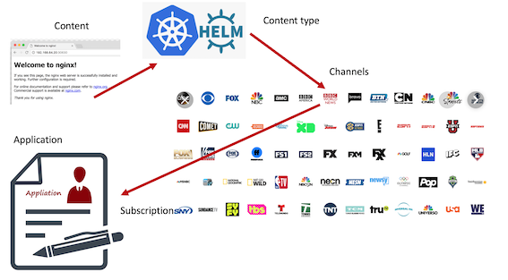

Here is a schematic describing how we now subscribe to a channel which
has connected content. Much like a TV broadcast model where households
subscribe to different channels for different content streams.
Schematically the diagram below describes the process.

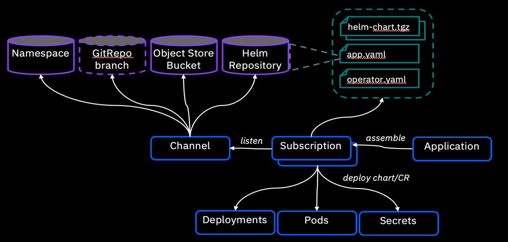

This lab walks you through the process of how to define channels
(namespace or helm repositories) and then subscribe to the channels to
deploy the applications across multiple clusters depending on the
subscription and placement policies.

<br>

## Objective

The objectives of this lab are to:

  - Learn how to define channels for the repositories holding
    application packages 
  - Learn how to subscribe to the channel to deploy an application
  - Change the placement policy rule and validate the policy is enforced
  - Learn CLI commands that are useful to gain insights into the state of the MCM application

<br>

## Prerequisites

The following prerequisites must be completed prior to beginning this lab:

  - Familiarity with basic Linux commands, Kubernetes commands, helm charts and YAML.
  - Concepts of management of Multicloud Management (managing multiple Kubernetes clusters)
  - A Management Cluster is available and ready to use.
  - An OpenShift cluster that needs to be managed

The following symbols appear in this document at places where additional
guidance is available.

| Icon                                              | Purpose              | Explanation                                                                                                                                                |
| ------------------------------------------------- | -------------------- | ---------------------------------------------------------------------------------------------------------------------------------------------------------- |
|          | Important\!          | **This symbol calls attention to a particular step or command. For example, it might alert you to type a command carefully because it is case sensitive.** |
|             | Information          | **This symbol indicates useful information that is good to know.**                                                                                         |
|  | **Trouble-shooting** | **This symbol indicates that you can fix a specific problem by completing the associated troubleshooting information.**                                    |

<br>

## What is Already Completed

Two OpenShift Clusters pre-deployed where one cluster acts as Management
Cluster and other acts as managed cluster.

  - On the management cluster, the management software is loaded.

  - The VMs with names (**master1, worker1, worker2**) are part of
    management cluster. It’s an Openshift 4.2 cluster.

  - The VMs with names **OCP** constitute the managed cluster. It’s an
    Openshift 3.11 all-in-one cluster.

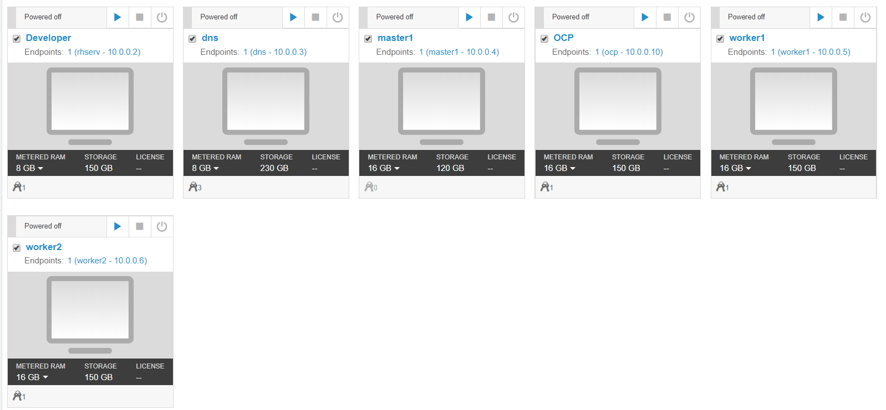

  - The **Developer** VM is the one you will use to access and work with
    in this lab.
  - The **DNS VM** works to support management cluster and cross-cluster
    DNS.

    **The login credentials for the **Developer** VM are:**
 
        User ID: ibmuser
        
        Password: passw0rd   (this is the same sudo password)
<br> 

## Lab Tasks

During this lab, you will complete the following tasks:

  - Log in to the Cluster to ensure they are operational
  - Define a channel definition (namespace based, and helm chart based) so that subscribers can pull the applications
  - Subscribe to the channel
  - Verify the application is deployed successfully, and test the
    application
  - Modify the placement policy to automatically deploy the application to an alternative managed cluster
  - Explore some useful CLI commands to determine state of the
    application and MCM resources

<br>

## Check the Environment 

### **Log in to the Workstation VM and get started**

1.  If the VMs are **<span class="underline">NOT</span>** already
    running, launch the lab VMs by clicking the **Play** button
    highlighted in the illustration of VMs above.

2.  After the VMs are started (takes few minutes), click the
    **Developer** VM icon to access it. The **Developer** **Linux
    Desktop** is displayed. You will execute all the lab tasks on this
    VM.

### **Check the Environment**

In this task, let’s check the Management environment to ensure it is up
and its pods are all running.

To check the environment, login to the “**Developer**” VM using userid:
**ibmuser** and password: **passw0rd**. The workstation has the required
tools **oc**, **cloudctl** and **helm** tools installed.

1.  Launch a terminal window and login to Management OpenShift Cluster.

        oc login -u admin -p passw0rd https://api.demo.ibmdte.net:6443 

2.  Verify all of the management pods are running in the Management cluster

        oc get pods -n kube-system |grep -v Running|grep -v Completed

        oc get pods -n multicluster-endpoint | grep -v Running|grep -v Completed

<table>
<tbody>
<tr class="odd">
<td></td>
<td><p>There should <strong>NOT</strong> be any pods listed in the results. That indicates all the pods are in the Running state.</p>
<p>If there are pods listed, and not running, contact the instructor, as the management cluster may not be running correctly.</p></td>
</tr>
</tbody>
</table>

3.  Get the route for the Multicloud Management Console (Named
    **icp-console**)

        oc -n kube-system get routes

    a) Select the value of **icp-console.apps.demo.ibmdte.net** like highlighted below

     > 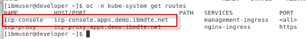

4.  Launch a browser and log in to the **Mutlicloud Management Console**

    URL: <a href="https://icp-console.apps.demo.ibmdte.net/multicloud/welcome">https://icp-console.apps.demo.ibmdte.net/multicloud/welcome</a>

        Lognin using the following credentials: 

          userid: admin
          password: passw0rd


5.  The console, welcome page should be displayed (**read below, if you do not get this page**)

    > 

<table>
<tbody>
<tr class="odd">
<td></td>
<td><p>If you see the incorrect page: “<strong>IBMCloud Pak</strong>” screen, <strong>Rerun</strong> the URL link again.</p>
<p><strong>This appears to be a bug in our environment</strong></p>
<p>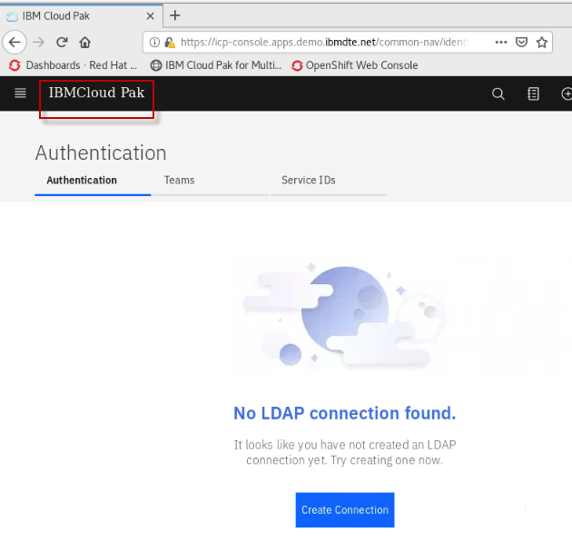</p></td>
</tr>
</tbody>
</table>

6.  Navigate to **Menu -\> Observe Environments -\> Overview.** This view displays the overall view of all the clusters that are managed.

    > 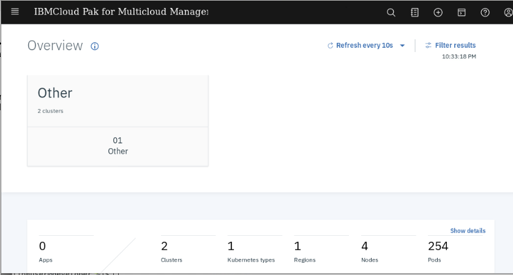

7.  From here, you can navigate to the Clusters, Nodes and the Pods
    views. As you scroll down, the overall state of the clusters is displayed.

    > 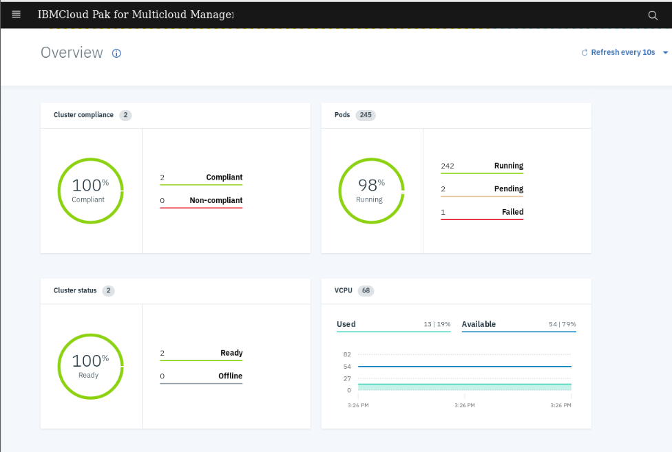

8.  In the console, go to **Menu -\> Automate infrastructure -\>
    Clusters**. This view shows the managed clusters.

    > 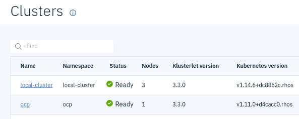

9.  Click the **local-cluster** cluster name to view the details of the cluster. The overview tab displays the details of the cluster and the nodes tab displays the details of nodes with its labels.

    > 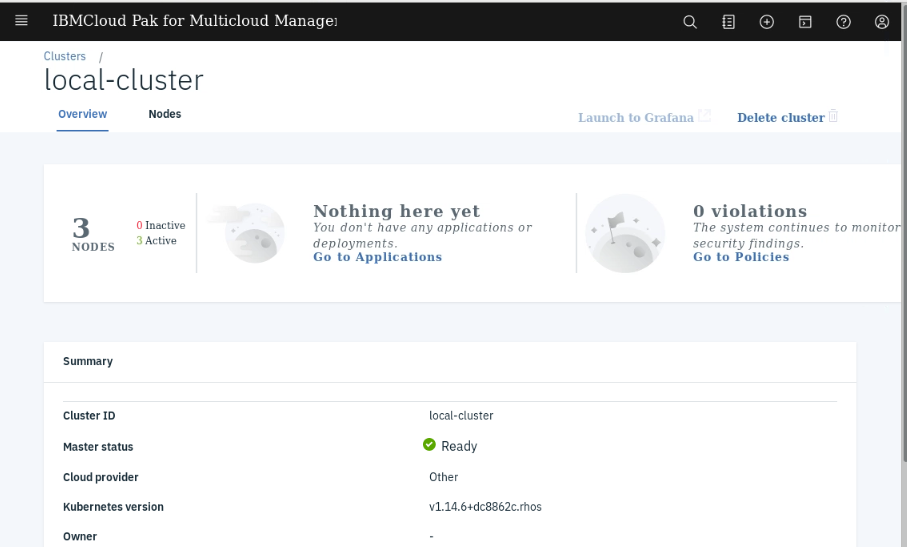

<br>

## Subscription to a Namespace Channel

In this task, you define a **namespace subscription channel** and subscribe to that channel.

Channels (Channel.app.ibm.com) define a namespace within the hub cluster and point to a physical place where resources are stored for deployment;
such as an object store, Kubernetes namespace, or Helm repository.

In this lab, the channel is of type “**namespace**” meaning that the
yaml you create will be deployed and stored in OpenShift namespaces,
rather than in a Helm chart or Object store.

Channels are custom resource definitions that can help you streamline
deployments and separate cluster access. Clusters can subscribe to
channels for identifying the deployables to deploy to each cluster.

Deployables within a channel can be accessed by only the clusters that
subscribe to that channel.

**You will perform the following tasks in this section**

  - Define the Modresort application as a channel
  - Deploy the channel
  - Define the namespace subscription model
  - Deploy the subscription
  - Check the application

<br> 

### **Define the application as a channel**

The **modresort** application is a simple application with only one
component.

  - Modresort: A WebSphere Liberty Java application - available in
    Dockerhub at kpostreich/modresort

    > 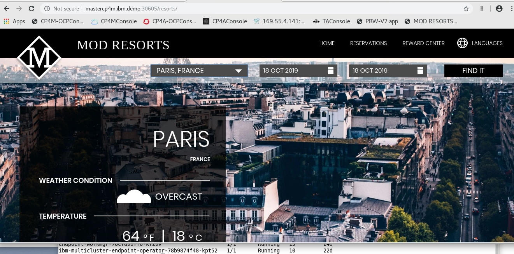
 
 <br> 

 **Construct the yaml files for the Channel definition and Deployables for the Modresort application**
 
In this section, you will create the yaml resources required to
construct the Channel and Deployables for the modresort application.
Finally, you will deploy the artifacts and its resources to an MCM managed cluster.

<table>
<tbody>
<tr class="odd">
<td></td>
<td><p><strong>Note:</strong> The yaml files that you will create in this section are also stored in an “Instructor” folder: <strong>/home/ibmuser/instructor/modresortchan</strong></p>
<p>You can use the snippets below to create the yaml files. Or, you can <strong>copy / paste</strong> the yaml files from the “Instructor” folder. It is your choice.</p></td>
</tr>
</tbody>
</table>

First, we need to create a working directory to create the resource definition files (yaml).

1.  Launch a command window, create a new directory, and then change directory to the new directory:
    **/home/ibmuser/student/modresortchan**

        mkdir -p /home/ibmuser/student/modresortchan

        cd /home/ibmuser/student/modresortchan

2.  In the **modresortchan** folder, use **gedit** or **vi** to create the **channel definition**. Name the file “**channel.yaml”**

    The **spec** collection defines the type of the channel. The contents of this file are shown below:
````
 apiVersion: app.ibm.com/v1alpha1
 kind: Channel
   metadata:
     name: modresort-devchan
     namespace: modresort-entitlement
  labels:
    app: modresortchan
spec:
  type: Namespace
  pathname: modresort-entitlement
````
  - Notice the **spec:type** is “**Namespace**”. The Kubernetes namespace where
    the channel is deployed will be **“modresort-entitlement”**. You will create this namespace later in the lab, when we deploy the channel definition to that namespace.

**Channels** (Channel.app.ibm.com) define a **namespace** within the **hub cluster** and point to a physical place where resources are stored for deployment. There are three types of channels. Each channel differs based on the type of source location where resources are stored:

  - **Kubernetes namespace**.  
    Uses deployables to store Kubernetes resource templates.
    Subscription for this type of channel retrieves and deploys the template. The namespaces that the channel monitors for new or updated deployables must be on the hub cluster.

  - **Object store**.  
    Stores Kubernetes resource YAML files. Each YAML file includes the template portion for one resource, not the full deployable object.
    An object store can be populated with a deployable object that is on the hub cluster or directly from a continuous integration pipeline, or by including the required YAML files into the object store.

  - **Helm repository**.  
    Stores Helm charts. For information about how to structure your charts, Refer to the on-line documentation for details on the construct of the channel definition:
    <https://www.ibm.com/support/knowledgecenter/en/SSFC4F_1.2.0/mcm/applications/managing_channels.html>

3.  The modresort application component consists of a Kubernetes **deployment resource definition** and a Kubernetes **service resource definition.**

    To enable these components to be used by the channel subscription, each of the resources need to be wrapped by a new custom resource definition (CRD) called **Deployable**.
    For the application to properly function with policy enforcement, this CRD is required.
 
    In the next step, create the Deployable resource for the modresort application.

4.  In the **modresortchan** folder, create the **Deployable** file with name **deployable.yaml using the content below:**

````
apiVersion: app.ibm.com/v1alpha1
kind: Deployable
metadata:
  name: devchan-modresortchan-deployment
  namespace: modresort-entitlement
  annotations:
    app.ibm.com/is-local-deployable: "false"
  labels:
    app: modresortchan
    component: main
    package: modresort
spec:
  template:
    kind: Deployment
    apiVersion: apps/v1
    metadata:
      name: devchan-modresortchan-deployment
    spec:
      selector:
        matchLabels:
          app: modresortchan
          release: modresort-devchan
          tier: frontend
      replicas: 1
      template:
        metadata:
          labels:
            app: modresortchan
            release: modresort-devchan
            tier: frontend
        spec:
          containers:
            - name: frontend
              image: "kpostreich/modresort:1.0"
              imagePullPolicy: Always
              ports:
                - containerPort: 9080
              env:
              - name: GET_HOSTS_FROM
                value: dns
              - name: WLP_LOGGING_CONSOLE_FORMAT
                value: json
              - name: WLP_LOGGING_CONSOLE_LOGLEVEL
                value: info
              - name: WLP_LOGGING_CONSOLE_SOURCE
                value: message,trace,accessLog,ffdc
---
apiVersion: app.ibm.com/v1alpha1
kind: Deployable
metadata:
  name: devchan-modresortchan-service
  namespace: modresort-entitlement
  annotations:
    app.ibm.com/is-local-deployable: "false"
  labels:
    app: modresortchan
    component: main
    package: modresort
spec:
  template:
    kind: Service
    apiVersion: v1
    metadata:
      name: devchan-modresortchan-service
      labels:
        app: modresortchan
        chart: modresortchan-0.1.0
        release: modresort-devchan
        heritage: Tiller
    spec:
      type: NodePort
      ports:
        - port: 9080
      selector:
        app: modresortchan
        release: modresort-devchan
        tier: frontend
````

**<span class="underline">Take note of a few elements of the Deployable
definition:</span>**

  - There are two Deployables defined in the yaml file that wrap the
    modresort Kubernetes resources
      - One for the modresort **deployment**
      - One for the modresort **service**

  - The Deployment and Service specs are specific to the Modresort application deployment to an OpenShift Cluster.
      - For example, the Deployment refers to the location where the Docker image will be pulled, number of replicas, etc
      - For example, the Service refers to the service port, and defines a NodePort for externally accessing the Modresort app in a test environment.

Refer to the on-line documentation for details on the construct of the
**Deployable** definition:
<https://www.ibm.com/support/knowledgecenter/en/SSFC4F_1.2.0/mcm/applications/managing_deployables.html>

<br>

## **Create a subscription**

The subscription to a channel package contains
  - Application Definition
  - Placement Rules Definition
  - Subscription Definition

**Applications** (Application.app.k8s.io) in IBM Multicloud Manager are used for grouping application components.

**Placement rules** (PlacementRule.app.ibm.com) define the target clusters where deployables can be deployed. You can use placement rules to help you facilitate the multi-cluster deployment of your deployables.
Placement rules can be referenced by deployables and subscriptions.

**Subscriptions** (Subscription.app.ibm.com) are sets of definitions that identify deployables within channels by using annotations, labels, and versions.

The subscription controller can monitor the channel for new or updated deployables, such as an updated Helm release or new Kubernetes deployable object. Then, the controller can download the Kubernetes deployable object or Helm release directly from the source location (Helm repository, object store, or namespace) to the target managed clusters.

### Create the resources for “Application”, “PlacementRule”, and “Subscription”

You will create these additional yaml resources for the application in a new folder for the application resources. They will also be deployed to a separate namespace than the Channel and Deployable resources.

<table>
<tbody>
<tr class="odd">
<td><blockquote>
<p></p>
</blockquote></td>
<td><blockquote>
<p><strong>Note:</strong> The yaml files that you will create in this section are also stored in an <strong>“Instructor”</strong> folder: <strong>/home/ibmuser/instructor/modresortapp</strong></p>
<p>You can use the snippets below to create the yaml files. Or, you can <strong>copy / paste</strong> the yaml files from the “Instructor” folder. It is your choice.</p>
</blockquote></td>
</tr>
</tbody>
</table>

1.  Create a new directory for your application **modresortapp**, and change to the new directory: **/home/ibmuser/student/modresortapp**

        mkdir /home/ibmuser/student/modresortapp

        cd /home/ibmuser/student/modresortapp


2.  Create the **application.yaml** which defines the grouping of the application components.

    Notice the resource kind is “Application”, and the Component kinds is a “Subscription”.

````
apiVersion: app.k8s.io/v1beta1
kind: Application
metadata:
  name: modresort101-modresortapp
  namespace: modresort-project
  labels:
    app: modresortapp
spec:
  selector:
    matchExpressions:
    - key: release
      operator: In
      values:
      - modresort101
  componentKinds:
  - group: app.ibm.com
    kind: Subscription
````
  Refer to the on-line documentation for details on configuring the Application resource:

https://www.ibm.com/support/knowledgecenter/en/SSFC4F_1.2.0/mcm/applications/app_lifecycle.html>

3.  Create **placementrules.yaml** file.

This contains the definition for placement of the components as selected by the user. In the definition you will find placement rule for the modresort component.

The selection criteria for where the application will be deployed is based on the “**environment**” cluster label.

The value of “**Dev**” means the Modresort app will be deployed to the local cluster. 

A value of “**Prod**” for the environment label, will result in the Modresort application being deployed to the managed cluster (OCP).

````
apiVersion: app.ibm.com/v1alpha1
kind: PlacementRule
metadata:
  name: modresortapp101-modresortapp
  namespace: modresort-project
  labels:
    app: modresortapp
    release: modresort101
spec:
  clusterReplicas: 1
  clusterLabels:
    matchLabels:  
      environment: Prod
````

Refer to the on-line documentation for details on configuring the PlacementRule resource:

<https://www.ibm.com/support/knowledgecenter/en/SSFC4F_1.2.0/mcm/applications/managing_placement_rules.html>

4.  Create **subscription.yaml** file.

    This contains the details for relating the placement rule definition with the application specification.

    - In the definition file, there is a **subscription** definition for
    the modresort application component, which references the modresort
    application **channel**.

    - Through this subscription, the modresort application will be
    deployed to the cluster based on the **placement rule** that is
    referenced here in the **subscription**.

````
apiVersion: app.ibm.com/v1alpha1
kind: Subscription
metadata:
  name: modresort101-modresortapp
  namespace: modresort-project
  labels:
    app: modresortapp
    release: modresort101
spec:
  channel: modresort-entitlement/modresort-devchan
  name: ""
  packageFilter:
    version: ">=1.x"
    labelSelector:
      matchLabels:
        package: modresort
        component: main
  placement:
    placementRef:
      name: modresortapp101-modresortapp
      kind: PlacementRule
      group: app.ibm.com
  overrides:
  - clusterName: "/"
    clusterOverrides:
    - path: "metadata.namespace"
      value: default
````

Refer to the on-line documentation for details on configuring the Subscription resource:

<https://www.ibm.com/support/knowledgecenter/en/SSFC4F_1.2.0/mcm/applications/managing_subscriptions.html>

This completes enabling an existing application with policies so that they can be deployed to any Kubernetes managed cluster via MCM placement policies.

<br>

## **Deploy the application that is built**

In this section, you will deploy the application components to their respective Kubernetes namespaces, using the yaml files that you created in the previous steps.

1.  Launch the command window and log in to the **hub** OpenShift cluster.

        oc login -u admin -p passw0rd https://api.demo.ibmdte.net:6443

2.  Use the icp-console URL to login to the Multicloud Management console CLI

        cloudctl login -a https://icp-console.apps.demo.ibmdte.net/ -u admin -p passw0rd -n default

    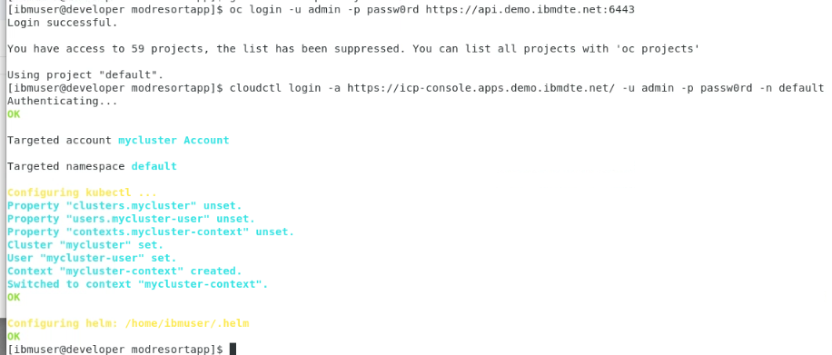

3.  As the channel is **namespace** based, create two namespaces (projects in OpenShift) where one is for the **subscription** and the other is for the **channel**. Run the following commands to create the projects in OpenShift

        oc new-project modresort-project

        oc new-project modresort-entitlement


4.  Deploy the **modresortchan** application (channel definition) to the **modresort**-**entitlement** project

        oc project modresort-entitlement

           OUTPUT: Already on project "modresort-entitlement" on server "https://api.demo.ibmdte.net:6443"

        cd /home/ibmuser/student

        oc apply -f modresortchan

    Output of the above command will be similar to the illustration below.
    The output shows that **Channel** and **Deployables** are created
 
    > 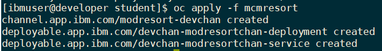

5.  Now deploy the **subscription** to the “**modresort-project”**
    namespace.

    The subscription is deployed to a different namespace than the  channel. Never deploy the subscription to the same namespace as the channel. Hence, deploy the subscription to the other namespace,  **modresort**-**project**

        oc project modresort-project

            OUTPUT: Now using project "modresort-project" on server "https://api.demo.ibmdte.net:6443"

        oc apply -f modresortapp


    > 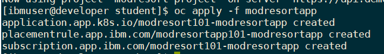
 
<br>

**Continue to the next section of the lab, which walks you through validating the application deployment.**

<br>

## **Validate the Application**

As the channel and the subscription are deployed, now you can validate if the application is running. 

1. Go to the console: <https://icp-console.apps.demo.ibmdte.net/multicloud/welcome> using username: **admin** and password: **passw0rd**

2. Check the "Applications view:" **menu -\> Manage Applications.** You should see the **application listed**.

<table>
<tbody>
<tr class="odd">
<td></td>
<td><p><strong>Note:</strong> It may take a couple of moments for the application to be available.</p>
<p>Be patient and refresh the page until the application is displayed in the UI.</p></td>
</tr>
</tbody>
</table>

  > 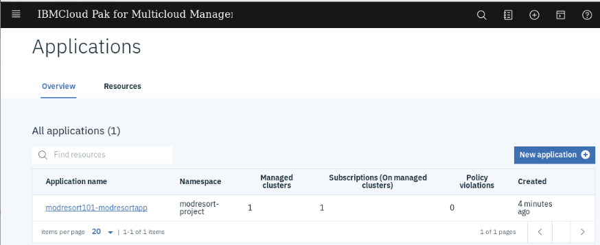

3.  Click on the **modresort101-modresortapp** application link to get to the application **Overview** page.
    
    a) Then, scroll down to view the **application diagram**

4.  You will see the **Resource Topology** for the modresort
    application.

    **Note:** It may take a couple of minutes for the application to > deploy to the cluster.
 
    When the application is successfully deployed, via the subscription, the pod 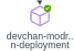 in the application topology view will have a GREEN icon, as illustrated below.
 
    > 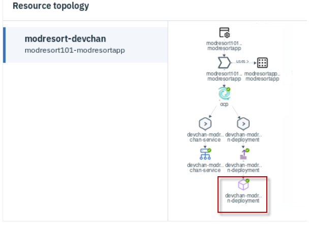

|                                           |                                                                                                                                                                                                                          |
| ----------------------------------------- | ------------------------------------------------------------------------------------------------------------------------------------------------------------------------------------------------------------------------ |
|  | **Note:** After a couple of minutes, if your pod has a **YELLOW** icon next to the pod, indicating it is in an unknown state, you will need to troubleshoot your yaml files for correctness, and redeploy the resources. |

5.  Check your subscriptions to verify they are subscribed and propagated

        oc get subscription.app.ibm.com --all-namespaces

    The subscription from the **mcm hub** should be in the “**Propagated”** state.

    > 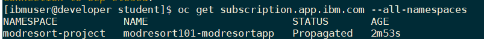

6.  Check your subscription on the ‘**ocp’** node (Prod) cluster to verify the subscription in in the **subscribed**” state.
    
    a) Open a **new** terminal window
    
    b) ssh into the **ocp** node using the credentials **ibmuser** / **passw0rd**

        ssh ocp -l ibmuser

              when prompted for the password enter: passw0rd


     c) Login to the **OCP** cluster (This is the **Prod** cluster)

        oc login -u admin -p passw0rd https://ocp.demo.ibmdte.net:8443

     d)  Check the status of the subscription in the “**default**” namespace in the OCP cluster.

     **Note:** The subscription.yaml file you created earlier defined the namespace for the Modresort application to be the “**default**” namespace in the target cluster.

        oc get subscription.app.ibm.com -n default

    The subscription in “**default**” namespace should be in the
 “**Subscribed**” state
 
    > 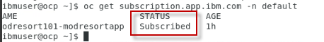

7. Check the modresort pod state in the “**default**” namespace in the OCP cluster

        oc get pods -n default

    You should see the **devchan-modresort-deployment** pod running in the “**default**” namespace
 
    > 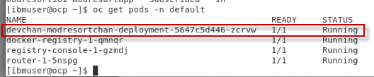

8.  Test the modresorts application from the browser

    **Note:** Ensure you run the following command from the **OCP** ssh terminal window

    a) Use the “oc get services -n default” command to get the **devchan-modresortchan-service** NodePort.

        oc get services -n default

    > 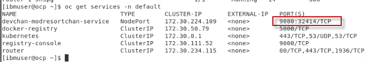

    b) From a browser: http://10.0.0.10:\<NodePort\>/resorts

    > 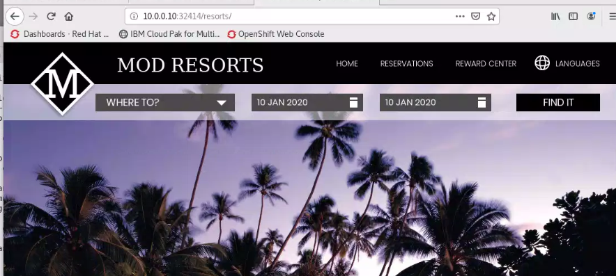

9.  Type “**exit**” to exit from the ssh of the OCP cluster

10.  **Close** the 2<sup>nd</sup> terminal window where you connected via ssh to the OCP cluster

**Congratulations\!** You have successfully deployed the modresorts application to the local OpenShift Cluster, using the MCM subscription based “Placementrule” deployment model.

<br>

## **Explore some valuable cli commands to view the state of the deployed resources**

Using the cli, you can check quite a few things about the deployed resources

1.  Ensure you are logged into to the **hub** openshift cluster.

        oc login -u admin -p passw0rd https://api.demo.ibmdte.net:6443

2.  Using the cli, check the placementrules using the “get
    placementrules” command:

        oc get placementrules --all-namespaces

    > 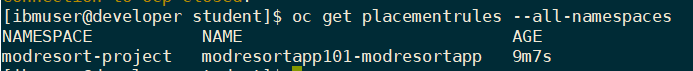

3.  Check where the subscription landed, in the **status** section of the output from the following command:

        oc get placementrules modresortapp101-modresortapp -n modresort-project -o yaml

    > 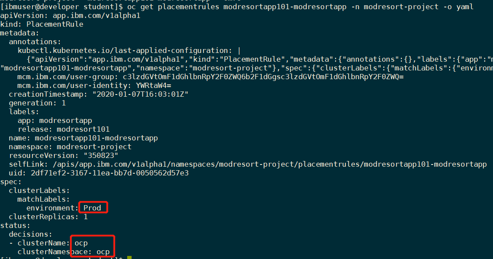

4.  Enter the command below to check all the **deployables**. Then you can check the deployables for any errors by using oc logs…. And oc describe commands as needed for troubleshooting.

        oc get deployables.app.ibm.com --all-namespaces

    > 

5.  Command to check the registered clusters

        oc get **cluster**s.**cluster**registry.k8s.io --all-namespaces

    > 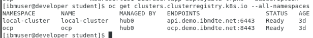

6.  Similarly, to check any resource, you can use **oc api-resources** to display all the resources and use any resource. For example:

        oc api-resources | grep deployable

    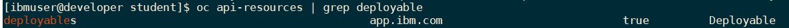

    From the above example, to get deployables, you specify the resource including its <strong>APIGROUP</strong> as illustrated below:

        oc get deployables.app.ibm.com --all-namespaces

7.  Here is the example and output from getting the MCM Application resources

        oc api-resources | grep application

    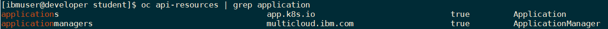

    From the above example, to get deployables, you specify the resource including its full API resource name, as illustrated below:

        oc get applications.app.k8s.io --all-namespaces

    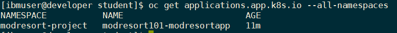


**Congratulations\!** You are now familiar with several important MCM specific CLI commands that can help you gain insights into the state of your MCM managed applications.

<br> 

## Modify placement rules to move the application to the "dev" managed cluster 

The previous portions of the lab deployed the modresort application to the managed cluster labeled as “**Prod**”. You can work with the placement rule to see how MCM can easily redeploy the application to a different cluster based on selection criteria in the placement rule.

In this section, you will modify the placement rule to redeploy the modresort application to the local cluster, labeled **Dev**”.
 
From the MCM clusters view in the MCM Hub console, you can see all the labels the admin set on the managed clusters.
 
These are the labels on the two managed clusters in the lab
environment. Notice the **environment** label. That is what you defined in the placement rule to deploy the application to the “Prod” cluster.
 
The environment label for the local managed cluster is
 **environment=Dev**

| **Dev Cluster**                | **Prod Cluster**               |
| ------------------------------ | ------------------------------ |
| 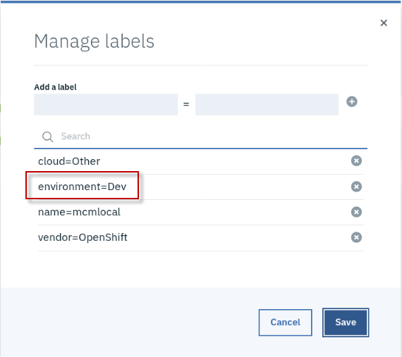 | 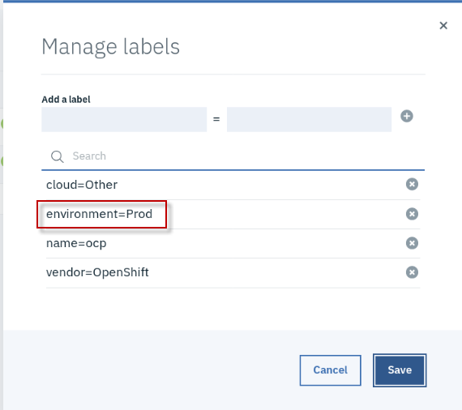 |

### Modify Placement Rules to deploy modresorts to the "Dev" managed cluster

1.  Return to the **Mutlicloud Management Console** in the Browser. If you closed the console, you can login again using the URL and credentials below.

    <table>
    <tbody>
    <tr class="odd">
    <td><p>URL: <a href="https://icp-console.apps.demo.ibmdte.net">https://icp-console.apps.demo.ibmdte.net</a></p>
    <blockquote>
    <p>userid: ibmuser</p>
    <p>password: passw0rd</p>
    </blockquote></td>
    </tr>
    </tbody>
    </table>

2.  From the menu, navigate to the “**Manage** **Applications”** view, where you will see the **modresort** application listed

    > 

3.  Click on the **modresort101-modresortapp** in the list.

4.  From the application **Overview** page, scroll down to the **Resource** **Topology** section

5.  You can edit the placement policy using the **Edit Topology** link located in the lower right corner, and then clicking on the **placement rules icon** as illustrated below.

    a)  Click on the **Edit Topology** link to view the yaml file.

    b)  Click on the **Placement Rules** icon, which will take you directly to the placement rules section of the yaml file.

    > 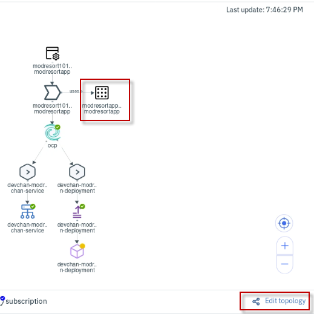

    c) Place curser on edge of the Editor view, and drag it left, widening the view area.

    > 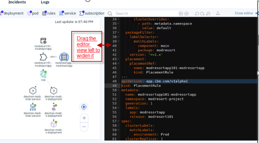

    d) Notice the Modresort application is currently deployed to the cluster labeled as “**Prod**”.

    > 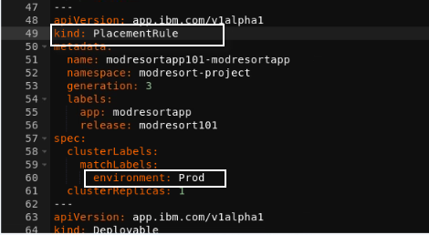

    e)  In the Yaml view, on approximately line \#60, modify the environment from Prod to **Dev**

    **Note:** Case Matters – Upper case “D”
 
    > 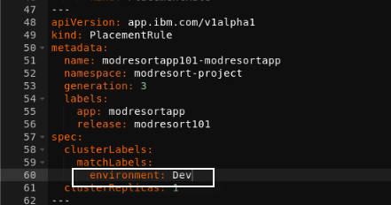

    f)  Click the Update icon 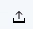 to save the changes to the yaml

    > 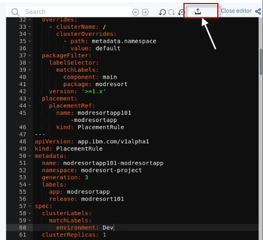

    g)  Click the **Close editor** link to close the yaml editor

    > 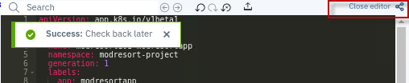

    h)  After a couple of minutes, the modresort application will be redeployed to the “**Dev**” managed cluster.


6.  Refresh the **application view**, then verify the Resource Topology section shows that application now deployed to “**Dev**”, which is the **local-cluster** cluster.
    
    a) The pod, once redeployed to the local cluster, will show in the running state, indicated by a **green** icon, as illustrated below: 
    
    It may take a couple of minutes for the application to be
    redeployed to the local cluster.

    > 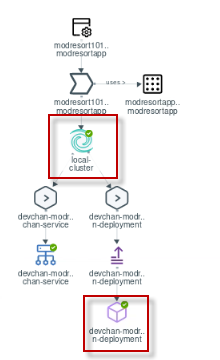

7.  Login to the local cluster CLI (hub cluster) to run **oc** commands to verify the application state.

        oc login -u admin -p passw0rd https://api.demo.ibmdte.net:6443

8.  You can use the following command to see if the modresort pod got deployed and its current state of the pod and subscription, and placement rules

        oc get pods -n default

        oc get subscription.app.ibm.com -n default</p>

        oc get placementrules modresortapp101-modresortapp -n modresort-project -o yaml

    **Note:** Output from the above commands are illustrated below:

    > 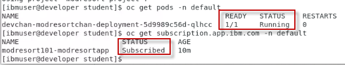
 
    > 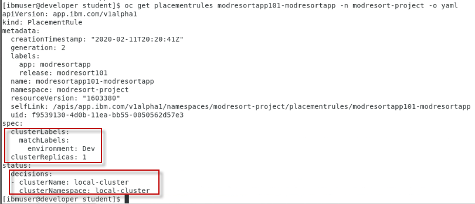

9. Test the modresorts application from the browser
    
    a)  Use the **oc get services -n default** command to get the **devchan-modresortchan-service** NodePort.

        oc get services -n default

2.  From a browser:
    [http://10.0.0.4:\<NodePort\>/resorts](http://10.0.0.4:%3cNodePort%3e/resorts)

    **Note:** 10.0.0.4 is the “Master” node of the **local-cluster** cluster (Dev)
 
    > 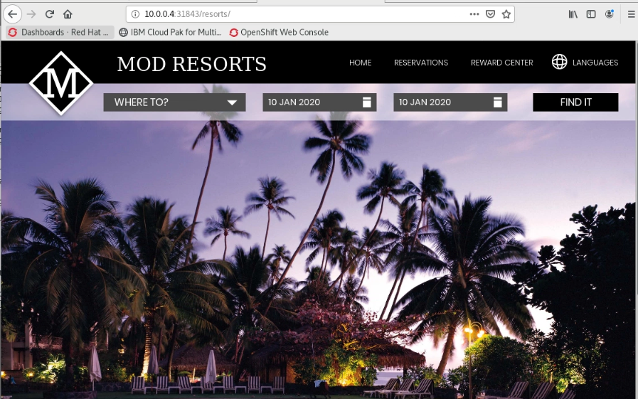
 
**Congratulations\!** You have successfully re-deployed the modresorts application to the “Prod” managed OpenShift Cluster, using the MCM subscription based “Placementrule” deployment model.

## 9 Summary

In this lab, you have learned how to enable an existing application definition with channel definition, subscription and placement rules.

**Congratulations\! You have successfully completed the lab “Application
Deployment”**
