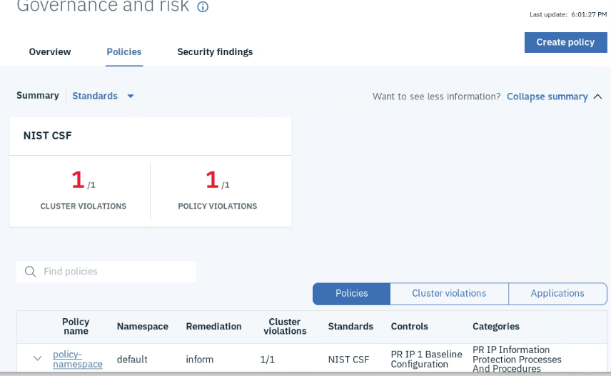
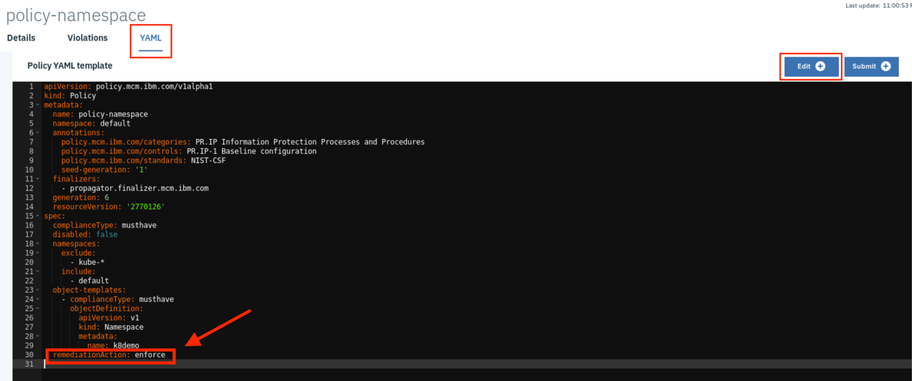
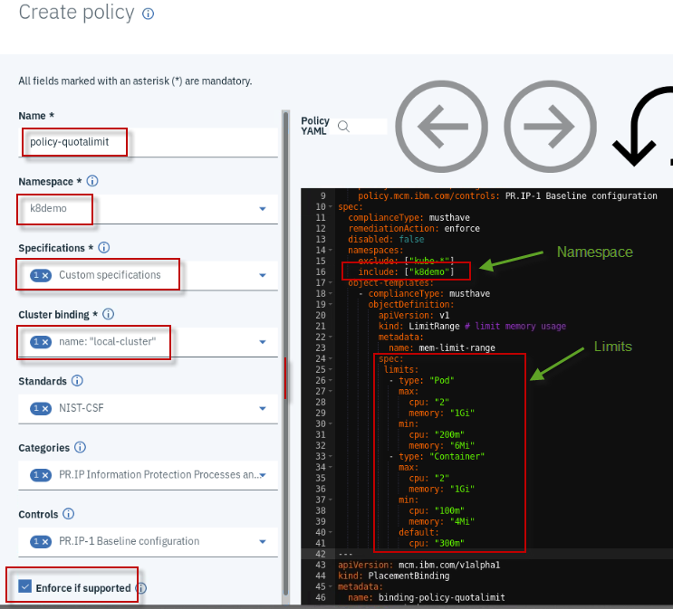
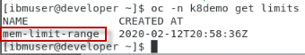
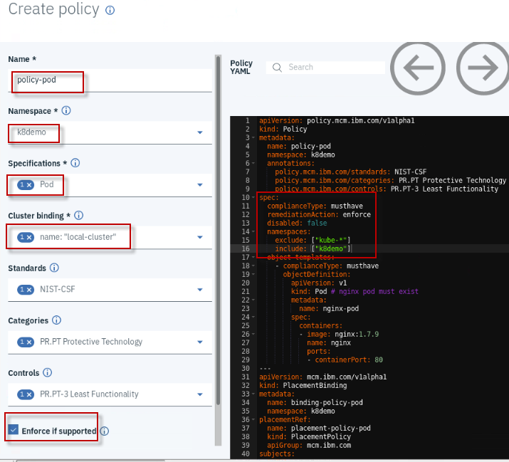

# ***Lab: ITC-26***

# ***Cloud Pak for MultiCloud Management - Governance Policy Lab***

 
## **Lab. How to create Policy and enforce it** 

The IBM Cloud Pak™ for Multicloud Management, running on Red Hat®
OpenShift®, provides consistent visibility, governance and automation
from on premises to the edge. Enterprises gain capabilities such as
multicluster management, event management, application management and
infrastructure management. Enterprises can leverage this IBM Cloud Pak
to help increase operational efficiency that is driven by intelligent
data analysis and predictive golden signals and gain built-in support
for their compliance management.

You can also take advantage of the governance, as with this IBM Cloud
Pak for Multicloud Management, you can manage your multicloud
environments with a consistent set of configuration and security
policies across all applications and clusters.

This lab walks you through the process of setting up policies and
evaluating them. It also serves as examples for creating your own
policies.

Here is a schematic describing how is the environment provided to create
your policies, inform and enforce to clear violations. One hub used also
as local cluster and a managed/remote cluster.


## Objective

The objectives of this lab are to:

  - Learn how to create different types of policies, check the state and
    enforce them to clear violations.

  - Enforce a complex policy using a defined use-case

## Prerequisites

The following prerequisites must be completed prior to beginning this
lab:

  - Familiarity with basic Linux commands and Kubernetes commands

  - A Management Cluster is available and ready to use

  - An OpenShift cluster that needs to be managed

The following symbols appear in this document at places where additional
guidance is available.

| Icon                                         | Purpose              | Explanation                                                                                                                                                |
| -------------------------------------------- | -------------------- | ---------------------------------------------------------------------------------------------------------------------------------------------------------- |
|          | Important\!          | **This symbol calls attention to a particular step or command. For example, it might alert you to type a command carefully because it is case sensitive.** |
|             | Information          | **This symbol indicates information that might not be necessary to complete a step, but is helpful or good to know.**                                      |
|  | **Trouble-shooting** | **This symbol indicates that you can fix a specific problem by completing the associated troubleshooting information.**                                    |

## What is Already Completed

Two OpenShift Clusters pre-deployed where one cluster acts as Management
Cluster and other acts as managed cluster.

  - On the management cluster, the management software is loaded.

  - The management cluster (named as local-cluster) also configured to
    manage itself.

  - The managed cluster (named as managed-cluster)


  - The **Developer** VM is the one you will use to access and work with
    **OCP** in this lab.

    **The login credentials for the Developer VM are:**

        User ID: ibmuser

        Password: passw0rd (this is the same sudo password)

## Lab Tasks

During this lab, you will complete the following tasks:

  - Log in to the Management Cluster from workstation

  - Use the console to create a few governance policies

  - Check the state of the created policies

  - Change the policy enforcement and validate the changes

## Execute Lab Tasks

### **Log in to the Workstation VM and get started**

1.  If the VMs are not already started, Launch the six lab VMs by
    clicking the **Play** button highlighted in the above picture.

2.  After the VMs are started (takes few minutes), click the
    **Developer** VM icon to access it.


The **Developer VM’s Linux Desktop** is displayed. You will execute all the lab tasks on this VM.

<br> 

### **Check the Environment**

In this task, let’s check the Management environment to ensure it is up
and its pods are all running.

To check the environment, login to the “**Developer**” VM using userid:
**ibmuser** and password: **passw0rd**. The workstation has the required
tools **oc**, **cloudctl** and **helm** tools installed

1.  Launch a terminal window and login to Management OpenShift Cluster.

         oc login -u admin -p passw0rd https://api.demo.ibmdte.net:6443

2.  Verify all of the managent pods are running in the Management
    clusters

        oc get pods -n kube-system | grep -v Running|grep -v Completed

        oc get pods -n multicluster-endpoint | grep -v Running|grep -v Completed


<table>
<tbody>
<tr class="odd">
<td></td>
<td><p>There should NOT be any pods listed in the results. That indicates all of the pods are in the Running state.</p>
<p>If there are pods listed, and not running, contact the instructor, as the managent cluster may not be running correctly.</p></td>
</tr>
</tbody>
</table>

3.  Launch a Mozilla Firefox browser, login to the Mutlicloud Management
    Console, there is already a bookmark configured

    URL: <a href="https://icp-console.apps.demo.ibmdte.net/multicloud/welcome"><span class="underline">https://icp-console.apps.demo.ibmdte.net/multicloud/welcome</span></a>

        userid: admin
        password: passw0rd


4.  You should see the Multicloud Management Consoles, Welcome page
    (**read below, if you do not get this page**)

    > 

<table>
<tbody>
<tr class="odd">
<td></td>
<td><p><strong>NOTE</strong>: If you see the incorrect page: “<strong>IBMCloud Pak</strong>” screen, <strong>Rerun</strong> the URL link again.</p>
<p><strong>This appears to be a bug in our lab environment</strong></p>
<p></p></td>
</tr>
</tbody>
</table>

<br> 

### **Reference: Introduction to IBM Multicloud Manager Policies**

IBM Multicloud Manager enables you to check whether your clusters are
operating properly by comparing the current configuration of various
resources against your desired state.

The system enables you to create compliance templates that can check
policies against roles, or pod objects within the clusters.

**IBM Multicloud Manager supports many types of policies.**

  - **Network policies** : Handled by the SDN (software defined network)
    resource

  - **MCM Policies** : handled by the MCM resource definition
    
      - Object template: Pods
    
      - Role template: Roles and role bindings

  - **Placement Policies** : Handled by the MCM

  - **Mutation Policies** : Handled by the mutation advisor resource
    
      - Container changes

**Remediation actions:**

There are two ways to handle a policy violation in your clusters:

1.  Auto remediation by policy controller when ‘**enforce**’ action is
    specified in policy
    
      - “**Inform**” action provides notification that a cluster is out
        of compliance, but does enforce compliance.

2.  Policy controller **generates Cloud Event Manager incidents** for
    policy **violations**

    MCM Hub generates **audit logs** to Security information and event management (SIEM) for findings (policy violations are also mapped to findings)


**Example: Mutation Policy**

> 

Refer to the documentation for more information:

<https://www.ibm.com/support/knowledgecenter/SSFC4F_1.2.0/mcm/compliance/compliance_intro.html>

<br>

### **Create a Namespace enforcement Policy**

This task creates a policy that ensures that a specified **namespace**
is present in clusters that match the selection criteria.

1.  Launch a new Terminal Window, and log in to OpenShift Cluster

        oc login -u admin -p passw0rd https://api.demo.ibmdte.net:6443

2.  Run the following command to ensure that the environment does not already have a namespace that the “Namespace Policy” will create and enforce.

        oc get ns | grep k8demo
         
           where <k8demo> is the name of the namespace we are searching


<table>
<tbody>
<tr class="odd">
<td></td>
<td><p>The previous command should <strong><span class="underline">NOT</span></strong> return any results.</p>
<p><strong>NOTE:</strong> If the namespace already exists, run the following command to delete it:</p>
<p><strong>oc delete project k8demo</strong></p></td>
</tr>
</tbody>
</table>

3.  Return to the MCM Web Console
        
      https://icp-console.apps.demo.ibmdte.net/multicloud/welcome 
        
        Login using the following Credentials: 

          User:admin
          Password: passw0rd
        
        

4.  Navigate to **Menu > Govern risk**. Here you can view and create
    compliance policies for your managed clusters**

    > 

5.  Click the **Policies** tab. This view displays the policies that
    have been created and the dashboard of policy compliance for each
    cluster. Currently, you do not have any compliance policies created.

    > 

6.  Click on **create policy**  button. Fill the values as specified in the table below:

<table>
<thead>
<tr class="header">
<th>Field Name</th>
<th>Value</th>
</tr>
</thead>
<tbody>
<tr class="odd">
<td>Name</td>
<td>policy-namespace</td>
</tr>
<tr class="even">
<td>Namespace</td>
<td>Choose the “<strong>default</strong>” namespace</td>
</tr>
<tr class="odd">
<td>Specifications</td>
<td><p>Choose: <strong>Namespace-must have namespace ‘prod’</strong></p>
<p><strong>Note:</strong> You will modify the name prod to k8demo.</p>
<p>Selecting this will provide a template to have custom namespace policy definition</p></td>
</tr>
<tr class="even">
<td>Cluster binding</td>
<td>Choose name: “<strong>local-cluster</strong>”</td>
</tr>
</tbody>
</table>

1.  In the **yaml file section**, on the right, change **prod** to
    **k8demo**.

    Changing the namespace will change the Policy Specifications to Custom Specifications as below. 

    Notice that the policy is set to “**inform**” rather than “**enforce**”.

    > 
     
    >

2.  Use the Create button,  to create your new policy.

3.  If you are not redirected automatically navigate to **Menu > Govern risk** to return to the Dashboard

4.  In few seconds, the policy controller will check if the namespace
    **k8demo** is present and provides information regarding the current
    compliance of the policies.

    Remember, you didn’t **enforce** this policy. Instead we specified **inform.**
    As such, the Governance and risk view displays a **policy violation** in our cluster, as illustrated below.
 
    > 

5.  Use the **Cluster Violations** link  to
    find which cluster is violating the policy. The link is located to
    the far right of the screen, as illustrated below.

    The **local-cluster** cluster is in violation of the policy which requires a namespace called “**k8demo**” to exist.
 
    The **local-cluster** cluster is our cluster, and the same cluster that verified “k8demo” namespace does not exist. Hence it shows that there is no namespace k8demo in the cluster.
 
    
    > 

6.  Verify the k8demo namespace still does not exist.

        oc get project | grep k8demo

    There should **NOT** be a namespace named **k8demo** listed, which indicates the policy did not ENFORCE it to be created.

7.  Change the “policy-namespace” policy to be **enforced**

    When a policy is in “**enforce**” mode, the namespace will automatically be created, if it does not exist, thereby enforcing the cluster into compliance.

    a)  In the **policies** view, select **POLICY VIOLATIONS link, as shown
    below**

    > 

    b)  Then, select the policy named “**policy-namespace**” and go to
    **YAML** view

    c)  Click on the  button to go into edit mode.

    d)  Change the value of “**remediationAction: inform**” to “**remediationAction: enforce**”

    e)  Click the  to submit the change

    > 

8.  Select the **policy-namespace** link. A few seconds later, the
    policy violation will be gone

    > 

9.  You also can validate the same from the **Violations** view.

    > 

10. Run the following command to ensure that the k8demo namespace has
    been created in the cluster.


        oc get ns | grep k8demo 

    > 

11. Try deleting the namespace and check how is being created
    automatically again.


        oc delete project k8demo

    > 

<br>

### **Create a Network Policy to enforce on a namespace**

In this task, you create a network policy just for informational
purpose. Then modify it to enforce the policy. In this scenario, the
Network Policy is used to control (block) network traffic from other
pods.

You will perform the following tasks:

  - Create a project (namespace) for this policy

  - Create NetworkPolicy targeting the new namespace

  - Check if the network policy is configured correctly

<!-- end list -->

1.  Let’s create a new project to enforce a **Network Deny** Policy to disable network traffic from pods

    a) login to Management OpenShift Cluster


        oc login -u admin -p passw0rd https://api.demo.ibmdte.net:6443

    b) Create a new project with name **denypolicy**

        oc new-project denypolicy

2.  Return to the **MCM console**. Then go to **Menu -\> Governance and Risk**

    This launches the policy management view. If there are no policy, no policies will be listed.

3.  Select the  button to create a new policy

    > 

4.  Configure the new **network policy** according to the table below

| Field Name         | Value                                        |
| ------------------ | -------------------------------------------- |
| Name of the policy | policy-network                               |
| Namespaces         | Choose: “denypolicy”                         |
| Specifications     | Choose: “Networkpolicy-deny network request” |
| Cluster binding    | Choose name: “**local-cluster**”             |

5.  In the right side section (YAML), change the namespace from
    **include: \[“default”\]** to **include: \[“denypolicy”\]**

    > 

6.  Select the  button which returns console to Policies view. After few seconds, you will find that there is a
    cluster **violation** on the network policy, **policy-network**

    > 

7.  Select the **CLUSTER VIOLATIONS** link to view which cluster is violating this policy. As, this policy is configured for
    informational purpose, the violation is just shown. It is not
    rectified.

    > 
 
    > 

8.  Change the “**policy-network**” policy to be enforced

    a) In the **policies** view, select **POLICY VIOLATIONS**

    > 

    b) Then, select the policy named “**policy-network**” and go to
    **YAML** view

    c) Click on the  button to go into edit mode.

    d) Change the value of “**remediationAction: inform**” to
    “**remediationAction: enforce**”

    > 

    e) Click the  to submit the change


9.  Go back to the **policy-network** view and see the violation is cleared

    > 
 
    > 

10. You can validate the network policy that is created on the namespace “**denypolicy**”.

    a) Using the CLI, run the following command to get the network
    policies for the namespace

        oc -n denypolicy get networkpolicies

    > 

<br>

### **Create Policy that limits memory range for a namespace**

In this task, you will create a policy where it enforces limits for memory range in a given namespace.

1.  Return to the **MCM console**. Then go to **Menu -\> Governance and
    Risk**.

    This launches the policy management view. If there are no policy, no policies will be listed.

2.  Select the  button to create a new policy

    > 

3.  Configure the new policy, enforcing quota limits, according to the table below:

| Field Name           | Value                                 |
| -------------------- | ------------------------------------- |
| Name                 | policy-quotalimit                     |
| Specifications       | Choose: Limitrange-limit memory usage |
| Namespaces           | Choose: k8demo                        |
| Cluster bindings     | Choose name: “**local-cluster**”      |
| Enforce if supported | Check the box                         |

4.  In the right-side section (**YAML**), change the namespace where the quota needs to be created.

    a) Change from **include: \[“default”\]** to **include: \[“k8demo”\]**,  which is a namespace we created earlier in the lab, by policy enforcement.

    As an enhancement, you will modify the YAML template to add the **quota** for the namespace, like max and min values for CPU and Memory along with a default range.

5. Modify the YAML to include the limits that were mentioned in the previous step.

    a) The **YAML file section** as highlighted below **before** and
    **after** is shown below. Ensure the whitespaces match the syntax, as illustrated below:

    

<table>
<thead>
<tr class="header">
<th><blockquote>
<p><u><strong>Before:</strong></u></p>

````
limits:
- default:
    memory: 512Mi
  defaultRequest:
    memory: 256Mi
  type: Container
````
</blockquote></th>
<th></th>
</tr>
</thead>
<tbody>
<tr class="odd">
<td><blockquote>
<p><u><strong>After:</strong></u></p>

````
limits:
- type: "Pod"
  max:
    cpu: "2"
    memory: "1Gi"
  min:
    cpu: "200m"
    memory: "6Mi"
- type: "Container"
  max:
    cpu: "2"
    memory: "1Gi"
  min: <br>
    cpu: "100m"
    memory: "4Mi"
  default:
    cpu: "300m"
````

</blockquote>
<td></td>
</tr>
</tbody>
</table>

6.  Review the YAML before you create the policy

    > 

7.  Select the  button to create the policy

8.  Validate if the policy is enforced.

    > 

9.  Validate the quota is created on the k8demo namespace

        oc -n k8demo get limits

    > 

        oc -n k8demo get limits -o yaml

    The resource limits for the k8sdemo namespace are shown below.
 
    > 

<br> 

### **Create Policy that a pod must exist in a given namespace**

In this task, you will create a policy where it enforces that a pod is present in a given namespace.

1.  Return to the **MCM console**, and go to **Menu -\> Governance and
    Risk**.

    This launches the policy management view. If there are no policy, no policies will be listed.

<table>
<tbody>
<tr class="odd">
<td></td>
<td><blockquote>
<p><strong>FYI:</strong> You may notice <strong>HIGH SEVEERITY SECURITY FINDINGS</strong> listed in the Governance and Risks section of the MCM console.</p>
<p>You can ignore these findings during the lab.</p>
<p>MCM records and maintains severity security findings based on the policies you have created. In this lab, the network security policy violation was a high severity security finding.</p>
<p>By default, MCM lists these findings, and will automatically be removed from the view after some pre-determined time in the future.</p>

</blockquote></td>
</tr>
</tbody>
</table>

2.  Select the  button to create a new policy

    > 

3.  Configure the new policy, requiring pod be present, according to the
    table below

| Field Name           | Value                            |
| -------------------- | -------------------------------- |
| Name                 | policy-pod                       |
| Specifications       | Choose: Pod-nginx pod must exist |
| Namespaces           | Choose: k8demo                   |
| Cluster bindings     | Choose name: “**local-cluster**” |
| Enforce if supported | Check the box                    |

4.  In the right side section (YAML), change the namespace where the pod needs to be created.

    a) Change from **include: \[“default”\]** to **include: \[“k8demo”\]**,
    which is a namespace we created earlier in the lab, by policy
    enforcement.

    > 

    b) Review the policy settings, as illustrated below

    > 

5.  Select the  button to create the policy

6.  Select the **policy-pod** to launch the policy view. You will find initially it will be in violation and will quickly turn to green as the enforcement kicks in and creates the pod.

<table>
<tbody>
<tr class="odd">
<td></td>
<td><h4 id="known-issue-false-positive-violation-when-enforcing-policy-to-create-a-pod-2286" class="list-paragraph">Known issue: False positive violation when enforcing policy to create a pod #2286</h1>
<p><strong>This will be fixed in the next iteration</strong></p></td>
</tr>
</tbody>
</table>

   > 


7.  From the CLI validate if the pod is running in the k8demo namespace
  
        oc -n k8demo get pods

    > 

<br> 

## Summary

In this lab, you have learned how to create policies both for
informational and enforcement purposes. You also learnt how to modify
the existing policies to change from inform to enforce mode.

**Congratulations\! You have successfully completed the lab “Policy Enforcement”**
